<div align="center">

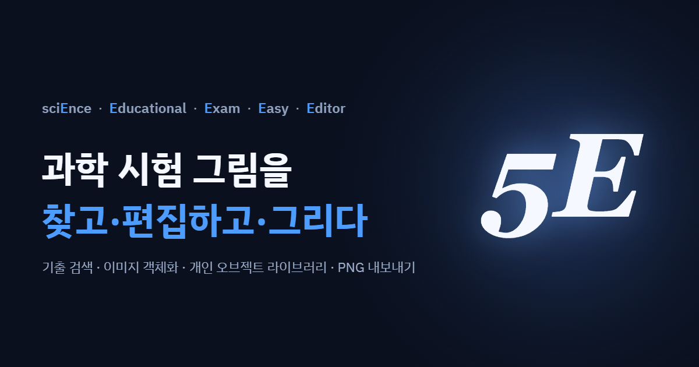

<p>
  
  
  
  
</p>

<p><strong>과학교사를 위한 시험용 이미지 제작기</strong> · 설치 없이 브라우저에서 · <a href="https://seungyeon980808-pixel.github.io/5E/">▶ 바로 써보기</a></p>

<p><a href="https://github.com/seungyeon980808-pixel/5E/releases/latest">최신 릴리즈 <strong>v1.2.0</strong> — 무엇이 바뀌었나</a></p>

</div>

---

**5E**(sciEnceEducationalExamEasyEditor)는 과학 교사가 시험지·학습지에 넣을 그림을 만드는 웹 도구입니다.
파워포인트나 그림판 대신, **평가원 지면에 그대로 얹을 수 있는 벡터 그림**을 빠르게 만들도록 설계했습니다.
설치가 필요 없고, 만든 파일은 내 컴퓨터에만 남습니다(서버로 올라가지 않습니다).

- **대상** — 과학(물리·화학·생명·지구과학) 교사, 시험지·학습지 제작자
- **스택** — 바닐라 JS + SVG, 빌드 없음. GitHub Pages 정적 배포
- **저장** — 프로젝트 JSON · 전체 백업 ZIP · 브라우저 자동 저장

## 목차

| | |
|---|---|
| [5분 둘러보기](#5분-둘러보기) | 화면이 어떻게 생겼는지 |
| [① 있는 그림에서 시작하기](#-있는-그림에서-시작하기) | 기출 검색 · 참고 창 · 오브젝트 저장소 |
| [② 그래프와 함수](#-그래프와-함수) | 좌표 · 함수 · 표시 3단계 |
| [③ 그리기 도구](#-그리기-도구) | 선 · 도형 · 텍스트 · 측정 · 자르기 |
| [④ 과목별 오브젝트](#-과목별-오브젝트) | 역학 · 전기자기학 · 파동 및 광학 부품 |
| [⑤ 이미지 다루기](#-이미지-다루기) | 객체화 · 비교 · 다중 배치 |
| [⑥ 편집을 빠르게](#-편집을-빠르게) | 스냅 · 그룹 · 속성 복사 · 전체 통일 |
| [⑦ 페이지와 내보내기](#-페이지와-내보내기) | 문항별 페이지 · 폴더 일괄 저장 |
| [⑧ 저장과 백업](#-저장과-백업) | 자동 저장 · ZIP 백업 |
| [⑨ 화면과 환경](#-화면과-환경) | Pro/Lite · 화면 크기 · 커맨드 팔레트 |
| [단축키](#단축키) | 전체 목록 |
| [로컬에서 실행](#로컬에서-실행) | 개발·오프라인 사용 |
| [릴리즈 이력](#릴리즈-이력) | 판마다 무엇이 바뀌었나 |

---

## 5분 둘러보기

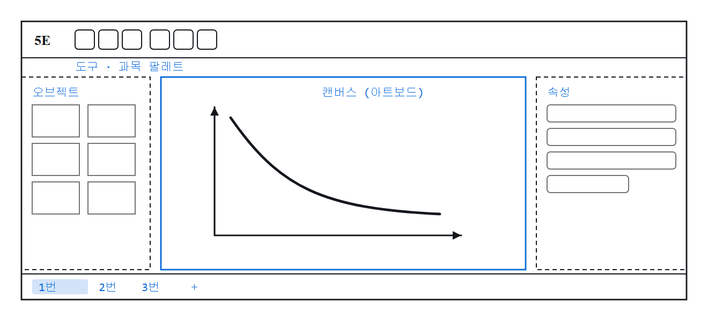

화면은 네 구역입니다.

1. **위쪽 툴바** — 그리기 도구와 과목 팔레트. 과목을 바꾸면 오브젝트 목록이 통째로 바뀝니다.
2. **왼쪽 패널** — 과목별 오브젝트, 내가 저장한 오브젝트, 이미지 객체화 도구
3. **가운데 캔버스** — 실제 그림이 놓이는 아트보드. 휠로 확대, 스페이스+드래그로 이동
4. **오른쪽 패널** — 선택한 것의 속성(굵기·색·글씨·좌표…). 선택한 종류에 따라 항목이 달라집니다
5. **아래 탭** — 페이지(문항) 목록. 문항 하나에 페이지 하나씩 쓰면 편합니다

전형적인 작업 흐름은 이렇습니다.

```
기출 문항 검색 → 캔버스로 불러오기 → 고쳐 쓰기 → 페이지별로 정리 → 폴더에 일괄 내보내기
```

처음부터 그리는 것도 물론 됩니다. 다만 **있는 그림을 고쳐 쓰는 쪽이 훨씬 빠릅니다.**

---

## ① 있는 그림에서 시작하기

### 기출 문항 검색 <kbd>Ctrl</kbd>+<kbd>Shift</kbd>+<kbd>F</kbd>

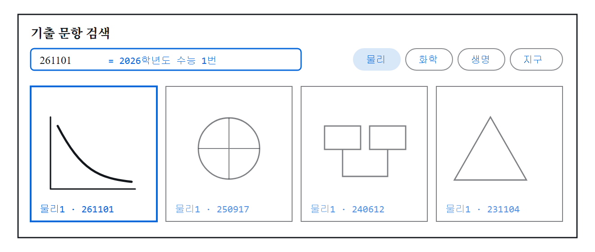

물리1·화학1·생명1·지구1 **552문항**의 도해가 들어 있습니다. 찾는 방법이 여러 가지입니다.

- **압축 코드** — `261101` = 2026학년도 수능 1번. 연도 2자리나 연·월만 넣어도 됩니다
- **드롭다운** — 과목 · 파트 · 연도 · 시행(수능/6월/9월)
- **의미 검색** — 동의어 사전을 태워, "빗면"으로 찾으면 "경사면"도 걸립니다
- **해시태그** — 문항에 붙은 태그로

카드를 고르면 캔버스로 들어오고, 그때부터는 평범한 오브젝트라 자유롭게 고칩니다.

### 참고 창 — 원본을 띄워 놓고 대조하기

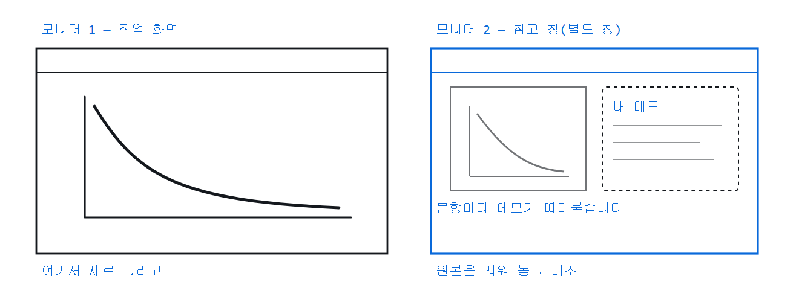

고른 문항을 **별도 브라우저 창**으로 띄웁니다. 듀얼 모니터라면 한쪽에 원본을 두고 다른 쪽에서 새로 그릴 수 있습니다.
문항마다 **메모**를 달 수 있고, 같은 문항을 다시 열면 적어 둔 메모가 그대로 나옵니다.
쓰지 않을 때는 아래 칩 막대로 최소화해 둡니다.

### 오브젝트 저장소 — 내가 만든 것 다시 쓰기

자주 쓰는 도해는 **오브젝트 저장**으로 개인 저장소에 넣어 둡니다. 과목별로 분류되고, 다음에 언제든 꺼내 씁니다.
브라우저 저장소의 5MB 상한에 걸리지 않도록 IndexedDB에 보관합니다.

---

## ② 그래프와 함수

시험지 그림의 절반은 그래프입니다. 그래서 그래프는 **전용 창**에서 만듭니다. 툴바의 `좌표/함수 생성`(<kbd>F</kbd>).

창은 세 단계로 나뉩니다.

```
① 좌표 — 축·격자·눈금을 만들고
② 함수 — 그 위에 곡선을 얹고
③ 표시 — 점·화살표·안내선·범례를 붙인다
```

### ① 좌표 — 축 만들기

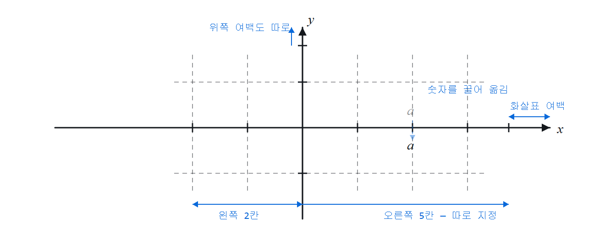

- **모양** — ㄴ자 / ㅏ자 / 십자 중 선택
- **비대칭 범위** — x·y의 음/양 방향 칸 수를 따로 지정. 왼쪽 2칸 · 오른쪽 5칸 같은 축이 만들어집니다
- **칸 범위 / 간격** — 축이 덮는 값과 격자 간격을 따로. 간격을 0.5로 주면 눈금이 촘촘해집니다
- **눈금 라벨** — 없음 / 숫자 / 배수(a, 2a, 3a…) / 직접 입력. 숫자는 **끌어서 위치를 옮길 수** 있습니다
- **고급 옵션** — 화살표 여백과 격자 튀어나옴을 네 끝 각각, 축 이름·눈금 글씨 크기, 라벨 이동 잠금

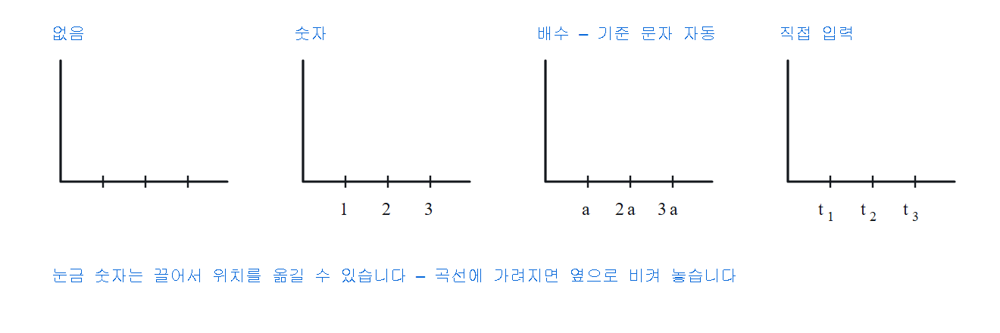

눈금 숫자가 곡선이나 다른 라벨에 가려지면 끌어서 옆으로 비켜 놓습니다.

### ② 함수 — 곡선 얹기

세 가지 방식이 하위 탭으로 나뉩니다.

| 탭 | 무엇 |
|---|---|
| **해석적 함수** | 수식을 입력해 그립니다. `sin`, `log`, 분수, 지수 모두 됩니다 |
| **직선·꺾은선** | 점을 찍어 잇습니다 |
| **자유곡선** | 마우스로 죽 끌어 그립니다 |

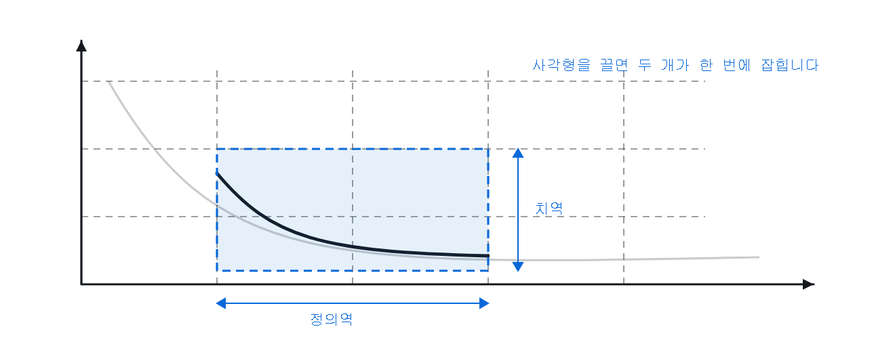

- **정의역·치역** — 값으로 입력하거나, 미리보기 위에 **사각형을 끌어 한 번에** 잡습니다. 그래프의 일부만 보여주는 문항에 씁니다
- **여러 함수** — 한 평면에 겹쳐 넣고, 선 종류(실선·파선·점선)와 굵기를 따로 줍니다
- **끝 라벨** — 곡선 끝에 이름을 붙입니다

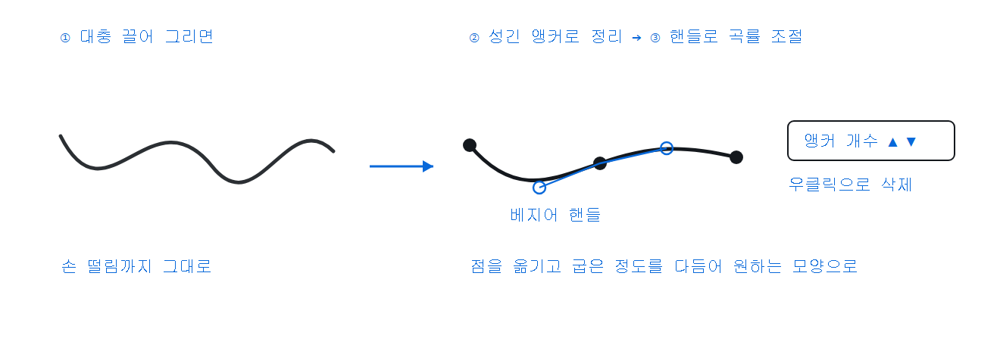

자유곡선은 **대충 끌어 그린 뒤 다듬는** 방식입니다. 그린 즉시 성긴 앵커로 정리되고, 앵커를 끌어 모양을 잡거나 베지어 핸들로 곡률을 조절합니다. 앵커 개수도 늘리고 줄일 수 있습니다(우클릭으로 삭제).
찍은 점은 **정확히 통과**합니다 — 점 사이에서 제멋대로 부풀지 않습니다.

### ③ 표시 — 점과 안내선 붙이기

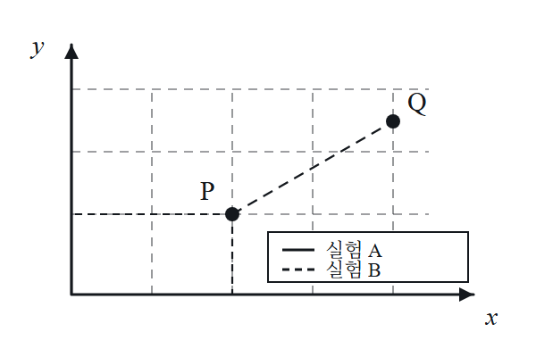

함수와 **무관하게** 얹는 층입니다. 함수가 없는 빈 평면에도 놓입니다.

- **표시점** — 까만 점
- **수선의 발** — 찍은 점에서 두 축까지 점선
- **화살표** — 곡선 위를 클릭하면 그 자리 접선 방향으로
- **가이드라인** — 두 점을 이어 안내 점선
- **범례 박스** — 선 견본 + 설명. 줄을 늘리고 자유롭게 옮깁니다
- **라벨러 표시점** — 아래

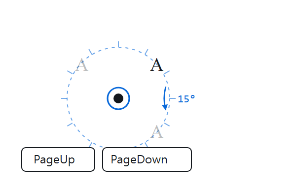

**라벨러 표시점**은 클릭한 순서대로 A·B·C 이름표가 붙고 점과 함께 움직입니다.
찍는 즉시 선택되어 <kbd>PageUp</kbd> <kbd>PageDown</kbd>으로 이름표 방향을 **15°씩** 돌립니다. 거리와 글씨 크기도 점마다 따로.

### 그 밖에

- **데이터 표 붙여넣기** — 엑셀에서 복사한 표를 붙이면 좌표평면 위 산점도가 됩니다
- **평가원 화살촉** — 축과 직선 끝의 화살촉을 실제 기출 지면에서 윤곽을 따 재현했습니다

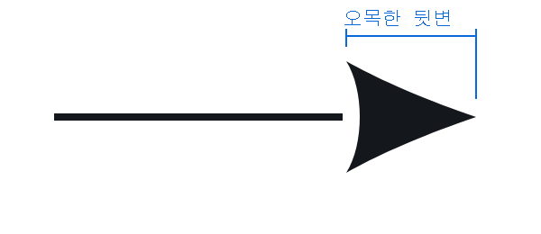

---

## ③ 그리기 도구

### 선

| 도구 | 키 | 설명 |
|---|---|---|
| 직선 | <kbd>L</kbd> | 끝에 화살표를 달 수 있습니다 |
| 꺾은선 | <kbd>P</kbd> | 클릭으로 꼭짓점 추가, 우클릭으로 완성 |
| 곡선 | <kbd>C</kbd> | 찍은 점을 지나는 매끄러운 곡선 |
| 자유 그리기 | <kbd>D</kbd> | 마우스로 죽 끌어 그리기 |

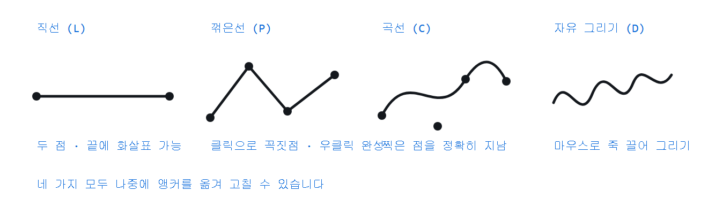

**언제 쓰나** — 눈금 없는 개념도의 축은 직선, 실험 장치의 실·줄은 꺾은선, 그래프 개형은 곡선, 지형이나 자기력선처럼 규칙 없는 모양은 자유 그리기.

모든 선은 **선 종류·굵기·색**을 따로 주고, 나중에 앵커를 옮겨 고칠 수 있습니다.

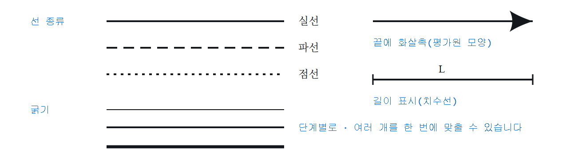

### 도형

타원 <kbd>O</kbd> · 사각형 <kbd>S</kbd> · 직각삼각형 <kbd>Y</kbd>. 채움과 테두리를 따로 정합니다.

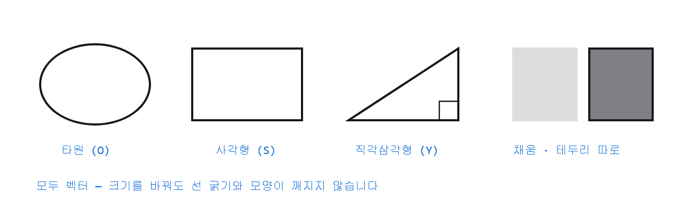

**언제 쓰나** — 물체·용기·블록처럼 그림의 몸통이 되는 것들. 채움을 옅게 주면 뒤에 있는 격자나 배경이 비쳐 보입니다.

### 텍스트와 수식

- **자유 텍스트** <kbd>T</kbd> — 글꼴·크기·정렬. 시험지 지면에 맞춘 **자간·장평** 조절
- **라벨러** <kbd>Shift</kbd>+<kbd>T</kbd> — 지시선 + 이름표. 대상을 옮기면 지시선이 따라옵니다
- **수식** — LaTeX 문법. 팔레트 버튼으로 기호를 넣고, 첨자·분수·근호·그리스 문자를 씁니다. 수식 글꼴은 LM Roman을 번들해 어느 PC에서나 같게 나옵니다
- **원문자** — ㉠㉡㉢㉣㉤ 등 시험지에 자주 쓰는 기호를 팔레트에서

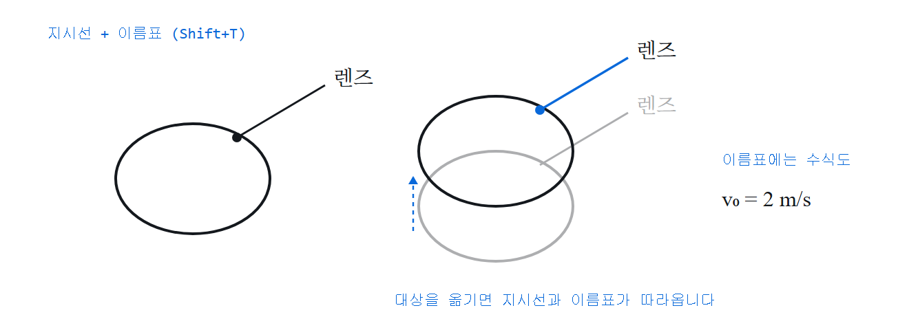

라벨러는 **지시선과 이름표가 한 몸**입니다. 대상을 옮기면 함께 따라오므로, 나중에 배치를 바꿔도 선을 다시 긋지 않습니다. 이름표 자리에는 수식도 들어갑니다.

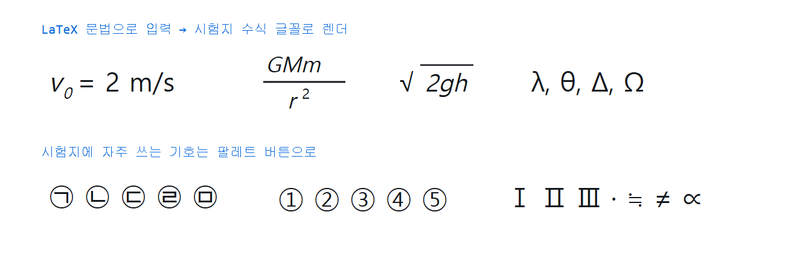

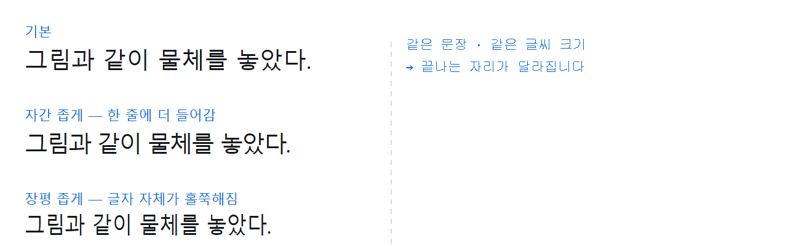

### 표시·측정

- **각도 호** <kbd>A</kbd> / **직각 표시** <kbd>Shift</kbd>+<kbd>A</kbd> — <kbd>Tab</kbd>으로 전환
- **점** <kbd>N</kbd>
- **길이 표시(치수선)** — 두 점 사이 거리에 라벨
- **자 · 각도기** — 화면 위에 올려놓고 각도와 길이를 재는 가이드. 그림에는 안 나갑니다

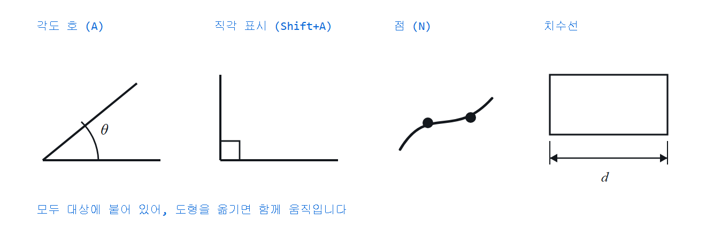

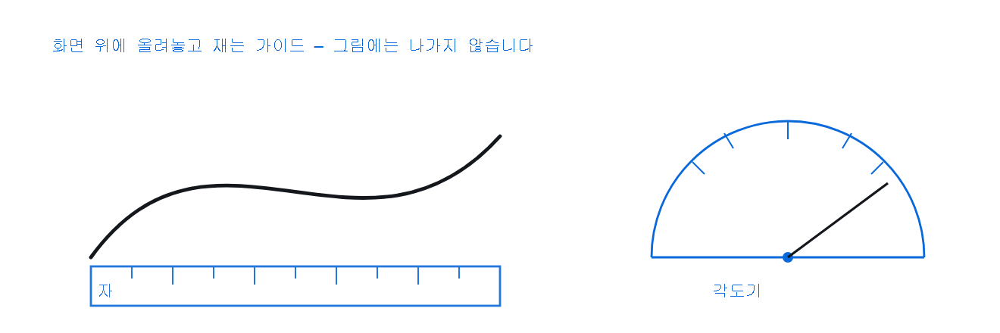

**언제 쓰나** — 자·각도기는 기출 지면을 흉내 낼 때 각도가 맞는지 눈으로 확인하는 용도입니다. 내보내기에는 포함되지 않으니 켜 둔 채 작업해도 됩니다.

### 자르기 <kbd>E</kbd>

가위로 오브젝트를 자릅니다. **자유곡선으로 자르고**, <kbd>Shift</kbd>를 누르면 직선, <kbd>Shift</kbd>+<kbd>Ctrl</kbd>은 각도 스냅.
채움이 있는 도형을 자르면 **채움을 유지한 채 둘로** 나뉩니다.

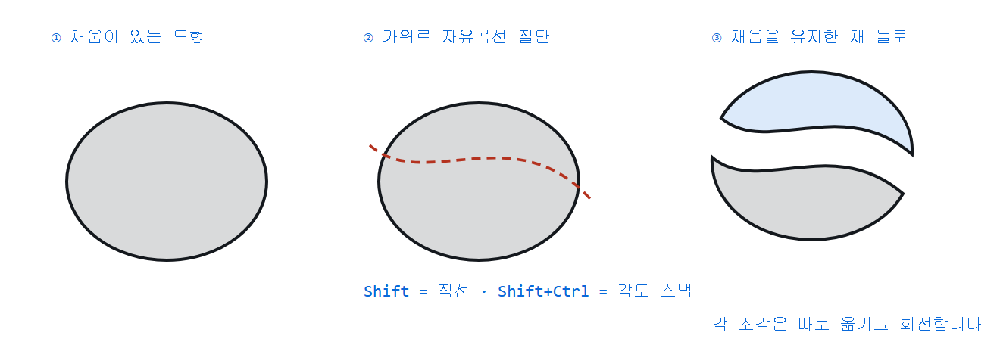

**언제 쓰나** — 단면을 보여줘야 하는 그림(잘린 관, 반쪽 렌즈, 지층 단면)에서 도형을 새로 그리는 대신 잘라 씁니다. 잘린 조각은 각각 따로 옮기고 회전합니다.

---

## ④ 과목별 오브젝트

그리지 않고 **끌어다 놓는** 부품들입니다. 벡터라 크기를 바꿔도 깨지지 않고, 선 굵기·색을 그림 전체와 맞출 수 있습니다.

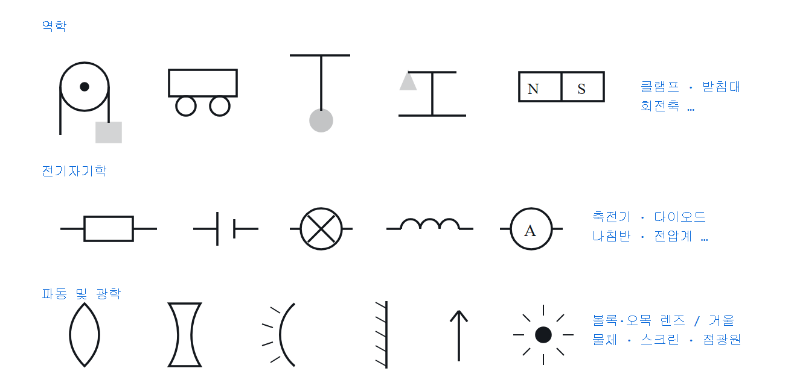

| 분류 | 들어 있는 것 |
|---|---|
| **역학** | 클램프 · 저울 · 도르래 · 역학 수레 · 단진자 · 받침대 · 회전축 · 막대자석 |
| **전기자기학** | 도선 · 나침반 · 저항 · 코일 · 축전기 · 직류전원 · 교류전원 · 전구 · 전류계 · 전압계 · 다이오드 · 미지소자 |
| **파동 및 광학** | 볼록렌즈 · 오목렌즈 · 볼록거울 · 오목거울 · 평면거울 · 물체 · 스크린 · 점광원 |

> **아직 비어 있는 칸** — 물리학의 *열역학 · 현대물리학* 파트와 화학 · 생명과학 · 지구과학의 팔레트는
> 분류만 만들어 두었고 부품은 아직 없습니다. 그 과목들도 **기출 문항 검색과 과목 테마는 정상 동작**하며,
> 필요한 그림은 기출 도해를 불러와 고쳐 쓰거나 직접 그린 뒤 오브젝트 저장소에 넣어 재사용하시면 됩니다.

## ⑤ 이미지 다루기

### 이미지 객체화 <kbd>Ctrl</kbd>+<kbd>T</kbd>

불러온 이미지(스캔·캡처)를 **편집 가능한 벡터 객체로** 바꿉니다. 필요한 부분만 남기거나 선을 고쳐 쓸 수 있습니다.

- 인식 강도를 조절합니다 — 묶음 거리 · 최소 크기 · 글자 판정 크기 · 곡선 단순화
- 미리보기에서 원치 않는 조각을 **클릭해 빼냅니다**
- 글자는 남기거나 · 지우거나 · 텍스트 객체로 바꿉니다
- 격자·눈금선만 걸러낼 수 있습니다

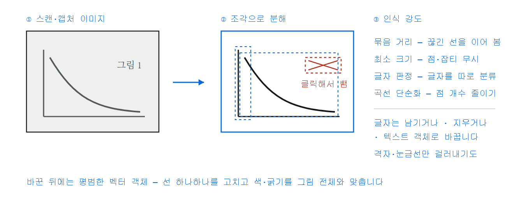

옵션 네 가지가 각각 무엇을 바꾸는지는 이렇습니다.

| 옵션 | 올리면 | 내리면 |
|---|---|---|
| **묶음 거리** | 끊어진 선을 하나로 이어 봅니다 | 조각이 잘게 나뉩니다 |
| **최소 크기** | 점·잡티를 무시합니다 | 작은 표시점까지 살립니다 |
| **글자 판정 크기** | 더 큰 것까지 글자로 봅니다 | 글자를 그림으로 봅니다 |
| **곡선 단순화** | 점이 줄어 가벼워집니다 | 원본 모양에 더 충실합니다 |

바꾼 뒤에는 평범한 벡터 객체라, 선 하나하나를 고치고 색·굵기를 그림 전체와 맞출 수 있습니다.

### 그 밖의 이미지 기능

- **여러 장 불러오기** — 한 페이지에 모으거나, 페이지마다 하나씩
- **원본 비교** — 그린 오브젝트와 원본 이미지를 좌우로 놓고 대조
- **인쇄 비교 배경** — 실제 지면을 반투명 배경으로 깔고 그 위에 맞춰 그립니다
- **영역 지우기** — 사각형·자유 영역으로 이미지의 일부를 지웁니다(되돌리기 가능)
- **붙여넣기** — 클립보드 이미지를 <kbd>Ctrl</kbd>+<kbd>V</kbd>로 바로

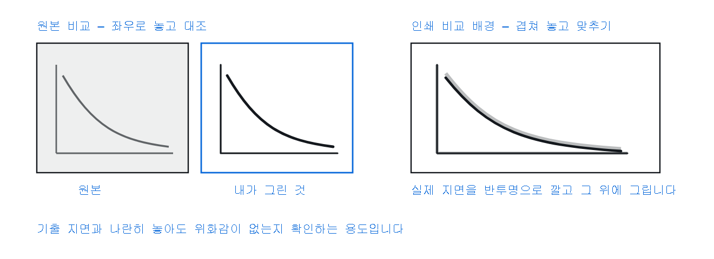

---

## ⑥ 편집을 빠르게

- **스냅** — 끝점·중점·교점에 달라붙습니다. **기울어진 면에는 회전해서** 붙습니다
- **격자·눈금자·중앙 고정** — 정렬 기준을 화면에 띄웁니다
- **그룹** <kbd>G</kbd> / 해제 <kbd>Shift</kbd>+<kbd>G</kbd>
- **잠금** <kbd>K</kbd> — 실수로 건드리지 않게. 잠근 것도 다시 풀 수 있습니다
- **속성 복사** <kbd>Shift</kbd>+<kbd>C</kbd> / **붙여넣기** <kbd>Shift</kbd>+<kbd>V</kbd> — 선 굵기·색·라벨·글꼴을 통째로
- **전체 통일/수정** — 선택한(또는 전체) 오브젝트의 굵기·색·글씨·각도·잠금을 한 번에 맞추거나 증감합니다
- **오브젝트 검색** <kbd>Ctrl</kbd>+<kbd>F</kbd> — 캔버스에 놓인 것을 이름으로 찾습니다
- **회전** <kbd>R</kbd> — 열린 곡선·꺾은선도 회전합니다

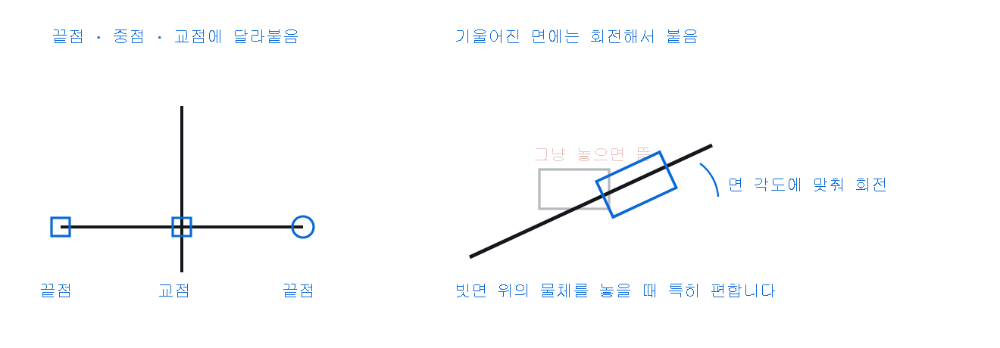

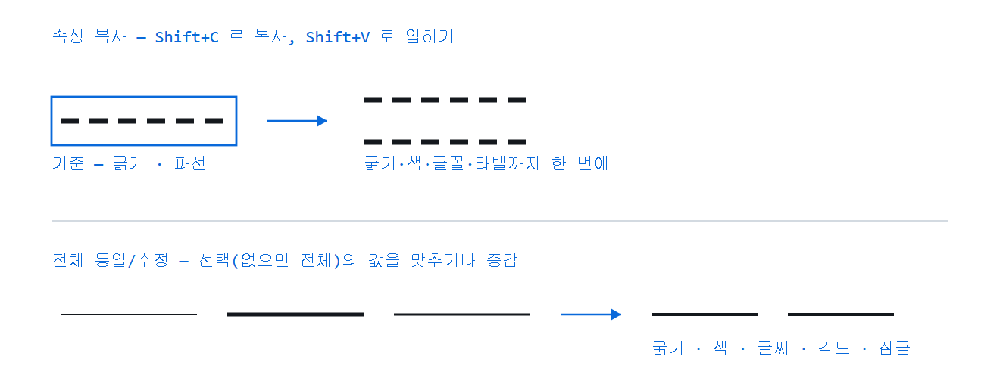

---

## ⑦ 페이지와 내보내기

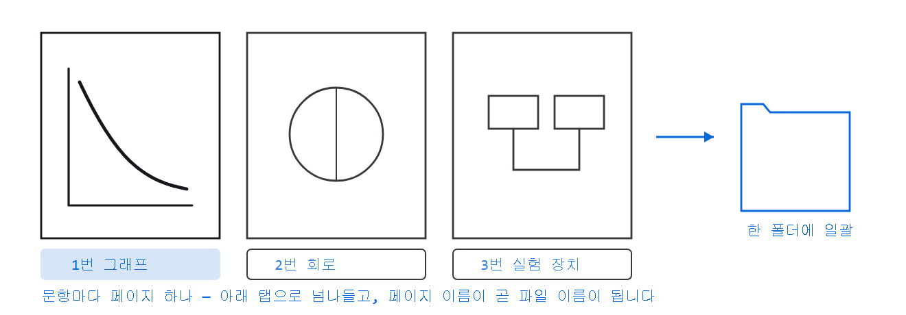

문항 하나에 페이지 하나. 아래 탭으로 넘나들고, 추가·복제·순서 변경이 됩니다. 페이지마다 문항 메타(과목·연도·번호)를 답니다.

내보내기는 두 가지입니다.

- **이미지로 내보내기** <kbd>Alt</kbd>+<kbd>P</kbd> — 지금 페이지를 PNG/SVG로. 200·300 dpi 선택, 선택 영역만도 가능
- **페이지 선택…** — 여러 페이지를 한 번에

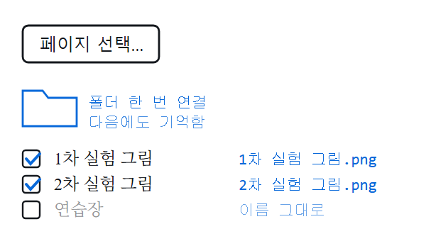

저장 폴더를 한 번 연결하면 **다음에 열어도 기억**합니다. 페이지에 지어준 이름이 그대로 파일명이 됩니다.

---

## ⑧ 저장과 백업

- **프로젝트 저장** <kbd>Ctrl</kbd>+<kbd>S</kbd> — JSON 한 파일. 파일을 캔버스에 끌어다 놓으면 바로 열립니다
- **자동 저장** — 작업이 브라우저에 계속 보관됩니다. 창을 실수로 닫아도 다음에 열 때 **복구할지 물어봅니다**
- **전체 백업(ZIP)** — 설정 + 내 오브젝트 + 현재 프로젝트를 한 파일로. 이미지를 바이너리로 담아 용량이 작습니다. 예전 JSON 백업도 그대로 열립니다

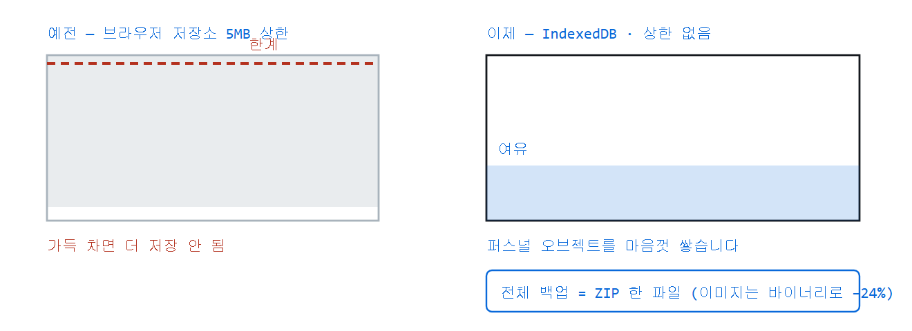

---

## ⑨ 화면과 환경

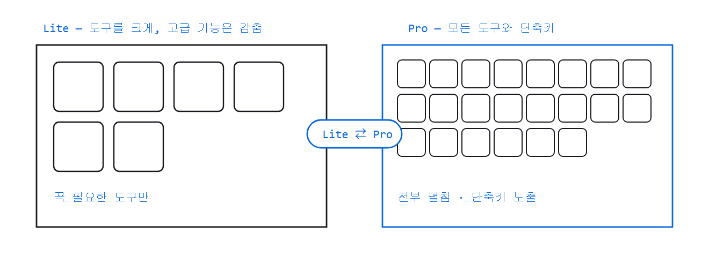

- **Pro / Lite** — Lite는 도구를 크게 키우고 고급 기능을 감춥니다. 단축키가 익숙하지 않을 때. 버튼 하나로 전환
- **화면 크기** — `설정 ▾ → 환경 설정`. 글자와 패널이 **같이** 커져 줄바꿈이 늘지 않습니다
- **커맨드 팔레트** <kbd>Ctrl</kbd>+<kbd>K</kbd> — 명령 18종을 이름으로 찾아 실행

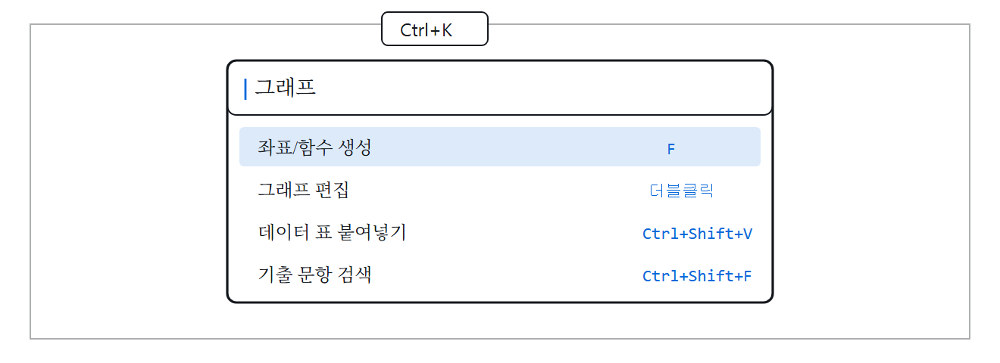

- **다크 테마 기본** · 전체화면
- **모바일** — 터치로 그리고 옮깁니다. 좁은 화면에서는 좌우 패널이 드로어로 접힙니다
- **PWA** — 브라우저에서 '앱으로 설치'하면 주소창 없이 뜹니다

---

## 단축키

### 도구

| 키 | 도구 | 키 | 도구 |
|---|---|---|---|
| <kbd>V</kbd> | 선택 | <kbd>L</kbd> | 직선 |
| <kbd>R</kbd> | 회전 | <kbd>P</kbd> | 꺾은선 |
| <kbd>S</kbd> | 사각형 | <kbd>C</kbd> | 곡선 |
| <kbd>O</kbd> | 타원 | <kbd>D</kbd> | 자유 그리기 |
| <kbd>Y</kbd> | 직각삼각형 | <kbd>E</kbd> | 자르기(가위) |
| <kbd>T</kbd> | 텍스트 | <kbd>Shift</kbd>+<kbd>T</kbd> | 라벨러 |
| <kbd>A</kbd> | 각도 호 | <kbd>Shift</kbd>+<kbd>A</kbd> | 직각 표시 |
| <kbd>N</kbd> | 점 | <kbd>F</kbd> | 좌표/함수 생성 |

### 명령

| 키 | 하는 일 |
|---|---|
| <kbd>Ctrl</kbd>+<kbd>K</kbd> | 커맨드 팔레트 |
| <kbd>Ctrl</kbd>+<kbd>S</kbd> | 프로젝트 저장 |
| <kbd>Ctrl</kbd>+<kbd>F</kbd> | 오브젝트 검색 |
| <kbd>Ctrl</kbd>+<kbd>Shift</kbd>+<kbd>F</kbd> | 기출문항 검색 |
| <kbd>Ctrl</kbd>+<kbd>T</kbd> | 이미지 객체화 |
| <kbd>Alt</kbd>+<kbd>P</kbd> | 이미지로 내보내기 |
| <kbd>Ctrl</kbd>+<kbd>Z</kbd> / <kbd>Ctrl</kbd>+<kbd>Shift</kbd>+<kbd>Z</kbd> | 실행취소 / 다시실행 |
| <kbd>G</kbd> / <kbd>Shift</kbd>+<kbd>G</kbd> | 묶기 / 분리 |
| <kbd>K</kbd> | 잠금 토글 |
| <kbd>Shift</kbd>+<kbd>C</kbd> / <kbd>Shift</kbd>+<kbd>V</kbd> | 속성 복사 / 붙여넣기 |
| <kbd>PageUp</kbd> / <kbd>PageDown</kbd> | 각도 15°씩 (라벨러 표시점 등) |
| 휠 / <kbd>Space</kbd>+드래그 | 확대 / 화면 이동 |

---

## 로컬에서 실행

정적 웹앱이라 빌드가 필요 없습니다. 받은 폴더에서 정적 서버만 띄우면 됩니다.

```powershell
python -m http.server 8000
```

브라우저에서 `http://localhost:8000`. Windows에서는 저장소에 있는 `run-server.bat`을 더블클릭해도 됩니다.

## 저장 파일 형식

프로젝트 JSON은 스키마 `0.17`을 쓰며 **페이지 단위**로 `objects`, `guides`, `layers`, `artboard`와 문항 메타를 담습니다(`pages[]`).
되돌리기 히스토리·선택 상태·화면 배율은 저장되지 않습니다.
구버전 파일은 열 때 자동 마이그레이션되고, 페이지 개념이 없던 파일은 한 페이지로 감싸 열립니다.

## 글꼴

수식 글꼴(LM Roman)은 woff2로 번들되어 어느 환경에서든 같게 나옵니다. 그 외 본문 글꼴은 설치된 시스템 글꼴을 따릅니다.

## 배포

정적 파일이라 GitHub Pages에 그대로 올라갑니다. 브라우저가 옛 모듈을 캐시하지 않도록 각 모듈의 `?v=` 값을 릴리즈 버전과 맞춰 둡니다.

## 릴리즈 이력

| 판 | 무엇이 들어갔나 |
|---|---|
| [**v1.2.0**](https://github.com/seungyeon980808-pixel/5E/releases/tag/v1.2.0) | 표시 탭 · 라벨러 표시점 · 평가원 화살촉 · 자간/장평 · 페이지 일괄 내보내기 |
| [v1.1.0](https://github.com/seungyeon980808-pixel/5E/releases/tag/v1.1.0) | 기출 문항 검색기 · 참고 창 · 자유곡선 베지어 편집 · 치역 지정 · ZIP 백업 |
| [v1.0.2](https://github.com/seungyeon980808-pixel/5E/releases/tag/v1.0.2) | 출시 전 정밀 감사 — 크래시·XSS 등 품질 수정 |
| [v1.0.1](https://github.com/seungyeon980808-pixel/5E/releases/tag/v1.0.1) | 자유곡선 정확 보간 · 앱 아이콘 · PWA |
| [v1.0.0](https://github.com/seungyeon980808-pixel/5E/releases/tag/v1.0.0) | 정식 출시 — 그래프 통합 도구 · 다중 페이지 · 기출 라이브러리 · 커맨드 팔레트 |

## 라이선스

**GNU AGPL v3** 하에 배포되는 자유 소프트웨어입니다. 비영리·교육 목적으로 자유롭게 사용·수정·공유할 수 있으며,
수정본을 배포하거나 웹서비스로 제공할 때는 소스코드를 공개해야 합니다. 전문은 [`LICENSE`](LICENSE).

## 크레딧

개발: 박승연 (서울 대왕중학교) · SMOE
Copyright © 2026 박승연
