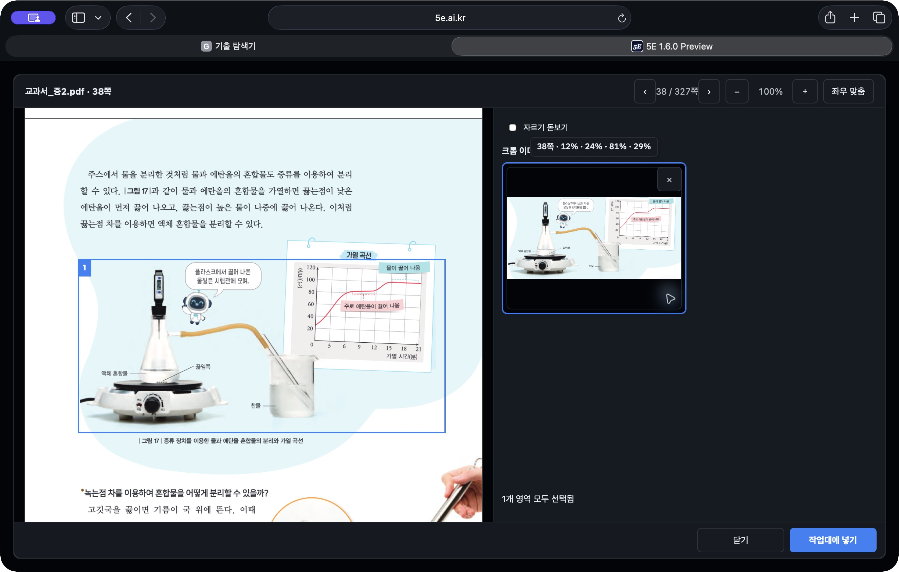
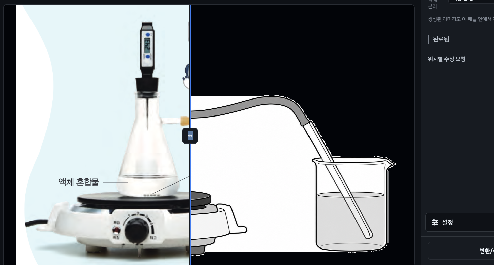
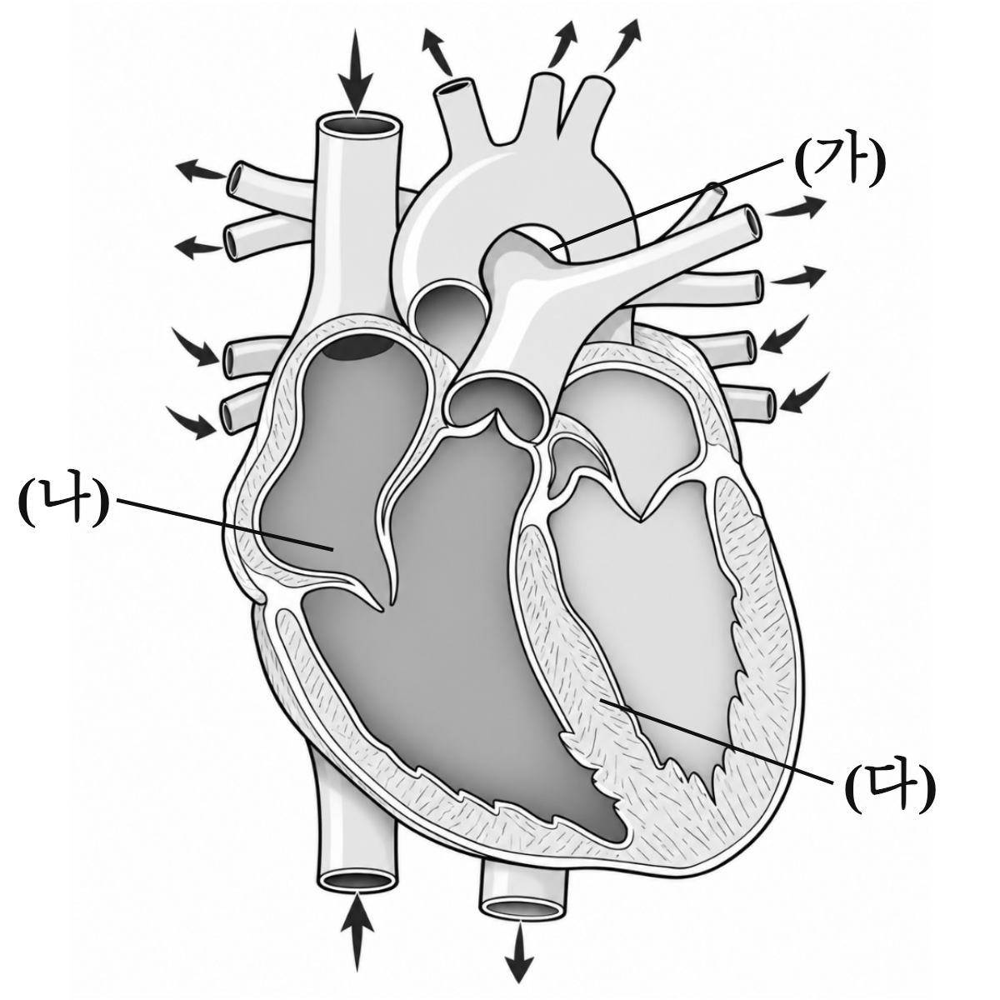
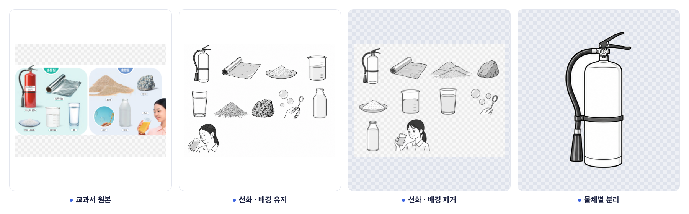
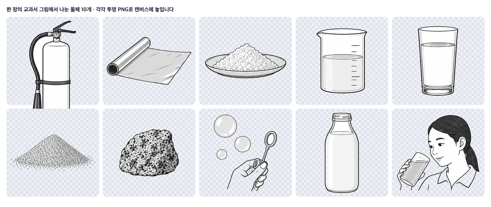
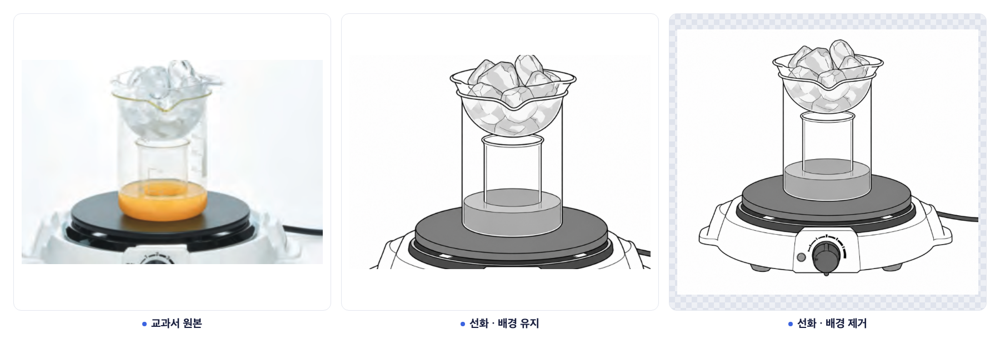
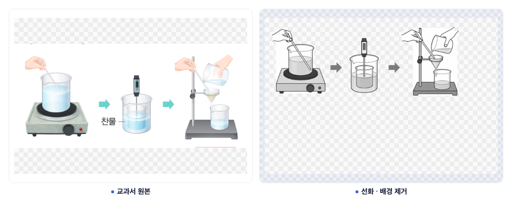

<p align="center">
  
</p>

<p align="center">
  <b>5E는 과학 교사를 위한 시험용 이미지 제작기입니다.</b><br>
  교과서·기출 PDF에서 그림을 잘라 AI로 평가원식 흑백 선화로 바꾸고, 다듬고 라벨을 붙여 바로 시험지에 넣습니다.
</p>

<p align="center">
  
  
  
  
  
</p>

<p align="center">
  <a href="https://www.5e.ai.kr/"></a>
  <a href="https://github.com/seungyeon980808-pixel/5E/releases/latest"></a>
</p>

<p align="center">
  <a href="#세-단계로-끝나는-시험용-그림">세 단계</a> ·
  <a href="#이런-그림을-만듭니다">결과 예시</a> ·
  <a href="#기능">기능</a> ·
  <a href="#시작하기">시작하기</a> ·
  <a href="#자주-묻는-질문">자주 묻는 질문</a> ·
  <a href="docs/RELEASE_NOTES_v1.6.0.md">1.6.0 변경 내용</a>
</p>

## 왜 5E인가요

시험지에 들어갈 그림 한 장을 만들려면 교과서를 스캔하고, 필요한 부분을 자르고, 그림판이나 일러스트 프로그램으로 선을 따고, 배경을 지우고, (가)(나)(다)를 붙이는 일을 여러 프로그램을 오가며 해야 했습니다. 5E는 이 과정을 **한 화면**에 모았습니다.

- **자료를 찾는 곳과 그리는 곳이 같습니다.** 교과서·기출 PDF를 검색해서 바로 자릅니다.
- **선을 직접 따지 않아도 됩니다.** AI가 평가원식 흑백 선화로 바꾸고, 마음에 안 드는 곳만 콕 집어 고칩니다.
- **시험지 규칙에 맞춥니다.** 배경 제거, 무채색, 선 굵기, 라벨 표기를 시험 그림 기준으로 정리합니다.
- **설치 없이 씁니다.** 웹에서 바로 열고, 필요하면 Windows·Mac 설치판을 씁니다.

## 세 단계로 끝나는 시험용 그림

<table>
<tr>
<td width="42%" valign="middle">

### ① 라이브러리에서 이미지 크롭

교과서·기출 PDF를 **본문 글자까지** 검색하고, 문서 전체를 넘겨 보며 필요한 그림을 드래그로 자릅니다. 한 쪽에서 여러 영역을 자르고, 여러 PDF에서 자른 그림을 보관함에 모았다가 한 번에 작업대로 보냅니다.

</td>
<td width="58%"></td>
</tr>
<tr>
<td width="42%" valign="middle">

### ② AI 이미지 변환

사진과 컬러 그림을 **평가원식 흑백 선화**로 바꿉니다. 원본과 겹쳐 비교하고, 고치고 싶은 곳에 점이나 영역 코멘트를 남기면 그 부분만 다시 그립니다.

</td>
<td width="58%"></td>
</tr>
<tr>
<td width="42%" valign="middle">

### ③ 후처리 및 라벨링

배경을 지우고, 물체별로 나누고, 라벨러로 (가)(나)(다)와 지시선을 붙입니다. PNG·SVG로 내보내 시험지에 바로 넣습니다.

</td>
<td width="58%"></td>
</tr>
</table>

## 이런 그림을 만듭니다

모두 실제 교과서 그림을 5E로 변환한 결과입니다.

### 한 장에서 물체 10개까지

교과서의 물질 모음 그림 한 장을 선화로 바꾼 뒤, 배경을 지우고 물체별로 나눴습니다.





### 배경 유지와 배경 제거

같은 결과를 흰 배경 그대로, 또는 투명 배경으로 받을 수 있습니다.



### 여러 장치가 이어진 실험 순서

가열 → 온도 측정 → 거름처럼 장치가 이어진 그림도 구도와 순서를 그대로 유지합니다.



## 기능

### 라이브러리

| 기능 | 설명 |
|---|---|
| PDF 본문 검색 | 기출·교과서 PDF의 글자까지 검색하고, 일치한 쪽으로 바로 이동합니다 |
| 학년도 필터 | 기출을 학년도 범위로 좁힙니다 |
| 연속 읽기 | 검색한 PDF를 전체 문서로 이어 보며 쪽을 넘기거나 스크롤합니다 |
| 여러 영역 크롭 | 한 쪽에서 여러 영역을 자르고, 나중에 다시 조정합니다. 키보드로도 자를 수 있습니다 |
| 크롭 보관함 | 여러 PDF에서 자른 그림을 모아 한 작업으로 묶거나 작업별로 나눠 보냅니다 |
| 공유 자료 연결 | 공개 Google Drive 폴더를 연결해 학교·교과 협의회 자료를 함께 씁니다 |
| 그림·부품 검색 | 그림, 과학 부품, 개인 오브젝트를 같은 검색창에서 찾습니다 |

### AI 이미지 변환

| 기능 | 설명 |
|---|---|
| 평가원식 선화 변환 | 사진과 컬러 그림을 시험지용 흑백 선화로 바꿉니다 |
| 부분 수정 | 점·영역 코멘트를 남기면 그 부분만 고친 후보를 받아 비교 후 적용합니다 |
| 겹쳐 비교 | 원본과 결과를 나란히 두거나 경계선을 움직여 겹쳐 봅니다 |
| 여러 원본 한 작업 | 원본 여러 장을 함께 참고하게 하거나, 한 장씩 작업을 나눕니다 |
| 여러 작업 동시 실행 | 작업 여러 개를 한꺼번에 변환하고, 작업마다 경과 시간을 확인합니다 |
| 모델 선택 | GPT-6 Sol·Luna 등 사용할 모델과 사고 수준을 고릅니다 |
| 실패 기록 | 실패하면 상세 기록을 열어 확인하고 복사합니다 |
| 작업 공유 | 보기 전용 또는 편집 가능한 복사본 링크로 동료와 나눕니다 |

### 후처리와 라벨링

| 기능 | 설명 |
|---|---|
| 배경·색·선 굵기 | 드롭다운에서 고르면 바로 미리보기에 반영됩니다 |
| 물체별 분리 | 자동 감지·격자·직접 지정으로 그림을 물체별 투명 PNG로 나눕니다 |
| 라벨러 | 확대경, 최대 다섯 시작점 연결, 선과 글자 간격 조절 |
| 내보내기 | PNG·SVG, 내용에 맞춘 저장, 여러 결과 ZIP 내보내기 |

### 캔버스와 편집

| 기능 | 설명 |
|---|---|
| 그리기 도구 | 선·도형·텍스트·지시선·자유 그리기·자르기·지우개 |
| 과학 부품 | 비커·플라스크·회로 소자·용수철·전극·세포막·염색체·주기율표 등 |
| 그래프 | 좌표평면, 함수 그래프(불연속 구간 보존), 데이터 그래프 |
| Lite / Pro | 자주 쓰는 도구만 보는 Lite, 모든 도구를 쓰는 Pro |
| 저장과 복구 | 프로젝트 파일로 저장하고, 갑자기 닫혀도 자동 저장에서 복구합니다 |

## 시작하기

### 웹에서 바로

1. [5e.ai.kr](https://www.5e.ai.kr/)을 엽니다. 설치는 필요 없습니다.
2. 캔버스 아래의 **라이브러리**에서 교과서·기출 PDF를 검색하고, 필요한 그림을 잘라 **작업대에 넣기**를 누릅니다.
3. **AI 이미지 변환**에서 ChatGPT 계정으로 로그인하고 **변환**을 누릅니다.
4. 결과를 확인하고 **캔버스에 삽입**으로 가져와 라벨을 붙인 뒤 PNG·SVG로 내보냅니다.

### 설치판

| 운영체제 | 받는 곳 |
|---|---|
| Windows x64 | [릴리즈 페이지](https://github.com/seungyeon980808-pixel/5E/releases/latest)의 설치 파일 |
| macOS | 준비 중 |

설치판은 내 컴퓨터의 Codex 로그인을 사용하고, 내 컴퓨터 폴더를 라이브러리에 연결할 수 있습니다.

### AI 연결

| 환경 | 연결 방식 |
|---|---|
| 웹 | AI 이미지 변환 창에서 ChatGPT 계정으로 기기 로그인 |
| 설치판 | 내 컴퓨터에 로그인된 Codex 사용 |

5E는 비밀번호나 인증 토큰을 저장하지 않습니다. AI 기능은 로그인한 계정의 기능과 이용 한도를 따르며, AI 연결 없이도 그리기와 편집은 모두 쓸 수 있습니다.

## 단축키

| 동작 | Windows | Mac |
|---|---|---|
| 실행 취소 / 다시 실행 | Ctrl+Z / Ctrl+Shift+Z | ⌘Z / ⌘⇧Z |
| 환경 설정 | Ctrl+, | ⌘, |
| 캔버스 확대·축소 | Ctrl + 휠 | ⌘ + 휠, 트랙패드 핀치 |
| 맨 위 창 닫기 | Esc | Esc |
| 크롭 영역 만들기 / 다음 영역 | Enter / Shift+Enter | Enter / Shift+Enter |

전체 단축키는 앱 안의 **단축키 도움말**에서 볼 수 있습니다.

## 자주 묻는 질문

<details>
<summary><b>AI 변환에 비용이 드나요?</b></summary>

5E 자체는 무료입니다. AI 변환은 로그인한 ChatGPT 계정의 기능과 이용 한도 안에서 실행됩니다.
</details>

<details>
<summary><b>변환 결과가 원본과 다르면 어떻게 하나요?</b></summary>

고치고 싶은 곳에 점이나 영역 코멘트를 남겨 부분 수정을 요청하세요. 요청하지 않은 부분은 그대로 보존합니다. AI 결과가 과학적 표현을 항상 정확히 지키지는 않으므로, 시험지에 넣기 전에 겹쳐 비교로 확인하세요.
</details>

<details>
<summary><b>물체별 분리는 벡터로 나뉘나요?</b></summary>

아니요. 이미지(래스터) 분리입니다. 각 물체가 투명 PNG로 나뉘며, 맞닿거나 겹친 물체는 함께 나뉠 수 있습니다.
</details>

<details>
<summary><b>작업은 어디에 저장되나요?</b></summary>

브라우저(또는 설치판) 안에 자동 저장되고, 원하면 프로젝트 파일로 내려받습니다. 웹과 설치판, 브라우저마다 저장 공간이 다르므로 옮길 때는 프로젝트 파일을 쓰세요.
</details>

<details>
<summary><b>교과서 그림을 써도 되나요?</b></summary>

교과서·기출 자료는 각 저작권자의 이용 조건을 따릅니다. 라이브러리에 자료가 보인다는 것이 이용 권리를 확인했다는 뜻은 아닙니다.
</details>

## 문서

- [1.6.0 변경 내용](docs/RELEASE_NOTES_v1.6.0.md)
- [사용 가이드](docs/USER_GUIDE.md)
- [릴리즈 이력](https://github.com/seungyeon980808-pixel/5E/releases)
- [이미지 출처](docs/credits.html)

<details>
<summary><b>개발자용: 로컬에서 실행하기</b></summary>

웹 화면은 정적 파일입니다. 저장소 루트에서 실행한 뒤 `http://localhost:8000`을 엽니다.

```sh
python3 -m http.server 8000
```

데스크톱 개발에는 [Node.js 24.21.x](.nvmrc)가 필요합니다.

```sh
npm ci
npm test
npm run test:browser
npm run desktop
```

설계 기록은 [DESIGN.md](DESIGN.md), 배포 절차는 [docs/GITHUB_RELEASES.md](docs/GITHUB_RELEASES.md)에 있습니다.

</details>

## 라이선스

5E는 [GNU AGPL v3](LICENSE)로 배포됩니다. 개발 박승연 · Copyright © 2026 박승연

