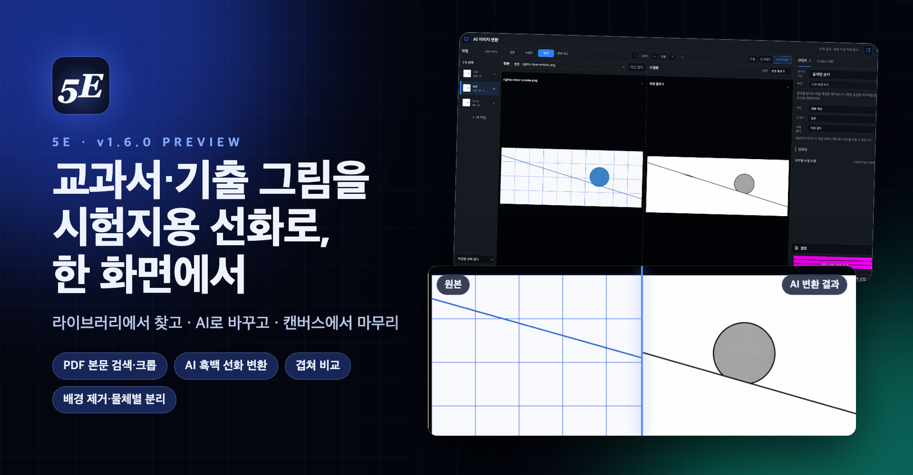

<div align="center">


<h1>5E</h1>

<p><strong>교과서·기출 그림을 시험지용 선화로, 한 화면에서</strong></p>

<p>과학 교사를 위한 시험용 그림 편집기</p>

<p>
  
  
  
</p>

<p><a href="https://www.5e.ai.kr/">웹에서 사용하기</a> · <a href="https://www.5e.ai.kr/preview/">1.6.0 미리보기</a> · <a href="https://github.com/seungyeon980808-pixel/5E/releases/tag/v1.5.8">Windows v1.5.8</a></p>

<p>최신 릴리즈 <strong>v1.5.8</strong> — Windows x64 설치판</p>

</div>



## 왜 5E인가요?

- **자료 찾기부터 한곳에서** — 기출·교과서 PDF를 검색하고, 전체 문서를 연속으로 읽으며 필요한 그림을 자릅니다.
- **시험지에 맞는 선화로** — 교과서 사진을 평가원식 흑백 선화로 변환하고, 점·영역 코멘트로 부분 수정을 요청합니다.
- **결과를 보며 마무리** — 원본과 결과를 겹쳐 비교하고, 배경 제거와 물체별 분리 후 캔버스에 넣습니다.
- **다음 수업에도 이어서** — 선·도형·텍스트·과학 부품을 더해 편집하고, 이미지와 프로젝트 파일로 보관합니다.

## 바로 시작하기

1. **[1.6.0 미리보기 열기](https://www.5e.ai.kr/preview/)** — 설치 없이 시작합니다. 아래 화면 설명은 이 미리보기를 기준으로 합니다.
2. **라이브러리에서 PDF 검색·크롭** — 필요한 페이지를 찾고 영역을 자른 뒤 AI 작업대로 보냅니다. 파일 선택이나 클립보드 이미지 붙여넣기도 가능합니다.
3. **AI 이미지 변환에서 ChatGPT 로그인 후 변환** — 결과를 원본과 비교하고 필요한 부분을 수정한 뒤 캔버스에 넣습니다. AI 서버는 시험 운영 중이며, 실계정 생성 흐름은 아직 검증하지 않았습니다.

AI 연결이 준비되지 않아도 일반 그리기와 편집은 사용할 수 있습니다. 결과를 보관하려면 이미지 또는 프로젝트 파일로 저장하세요.

## 화면별 기능

### 라이브러리

그림·부품·PDF를 한곳에서 찾습니다. 기출·교과서 PDF를 검색하고 전체 문서를 스크롤하거나 페이지를 넘겨 읽습니다. 여러 PDF에서 자른 그림은 보관함에 모아 영역을 다시 조정하고, 함께 쓸 그림과 개별 AI 작업대로 보낼 그림을 지정할 수 있습니다.

공개 Google Drive 자료도 연결합니다. 미리보기의 **5E 공유 자료** 트리에는 **PDF 422개**가 표시됩니다(2026-09-29 기준). 자료 수는 바뀔 수 있으며, 공유 자료의 표시가 이용 권리 확인을 뜻하지는 않습니다.

### AI 이미지 변환

참고 사진을 시험용 흑백 선화로 변환합니다. 결과에 점·영역 코멘트를 남겨 부분 수정을 요청하고, 수정 후보를 확인해 적용합니다. 원본과 결과를 나란히 보거나 경계선을 움직여 겹쳐 비교할 수 있습니다.

배경 제거·무채색·선 굵기를 조절하고, 자동 감지·격자·직접 지정으로 그림을 물체별 이미지로 나누어 캔버스에 넣습니다. 여러 원본을 한 작업에 모으거나 별도 작업으로 나누고, 선택한 작업을 함께 실행하며 작업별 경과 시간과 대기 상태를 확인합니다.

**물체별 분리는 래스터 이미지 분리이며 내부 선 벡터화가 아닙니다.** 맞닿거나 겹친 물체는 함께 분리될 수 있습니다. AI가 원본 구도와 과학적 표현을 항상 보존하지는 않으므로 결과를 비교한 뒤 사용하세요.

AI 작업은 보기 전용 또는 편집 가능한 복사본으로 공유할 수 있습니다. 링크는 최대 1시간 동안 임시 보관되며 서버 재시작 시 더 일찍 사라질 수 있습니다. 편집은 받는 사람의 복사본에 적용됩니다.

### 캔버스

오브젝트를 이동·자르기·회전하고 선·도형·텍스트·지시선·좌표·함수·과학 부품을 더합니다. 라벨러는 확대경과 최대 다섯 시작점 연결을 지원합니다. 패널을 열고 닫을 때 캔버스 위치를 유지하고, 페이지별 실행 취소 기록으로 편집을 되돌릴 수 있습니다.

PNG·SVG 이미지로 내보내거나 프로젝트 파일로 저장해 다음 작업에서 다시 엽니다. 웹에서 Mac·Windows용 실행형 프로젝트를 내려받는 기능도 있지만 **운영체제별 실행 검증은 아직 남아 있습니다.** 버전을 옮기기 전에는 프로젝트 파일을 별도로 백업하세요. 웹·데스크톱과 브라우저별 저장 공간은 서로 다를 수 있습니다.

### Lite와 Pro

**Lite**는 자주 쓰는 도구와 메인 캔버스에 집중한 화면입니다. **Pro**는 더 많은 그리기·오브젝트 도구를 제공합니다. 1.6.0에서는 모드를 바꿀 때 현재 작업을 이어갈지 새 작업으로 시작할지 선택합니다. 새 작업 전 도면을 복구용으로 보관하고, 이후 자동 저장이 그 내용을 덮어쓰지 않도록 보완했습니다.

## 지금 사용할 수 있는 버전

| 채널 | 버전 | 이용 방법 |
|---|---|---|
| 웹 | 1.5.3 | [5E 열기](https://www.5e.ai.kr/) · 설치 없이 사용 |
| 웹 미리보기 | 1.6.0 Preview | [미리보기 열기](https://www.5e.ai.kr/preview/) · 개발 중인 화면 |
| Windows x64 설치판 | 1.5.8 | [GitHub Release에서 다운로드](https://github.com/seungyeon980808-pixel/5E/releases/tag/v1.5.8) |
| 다음 릴리즈 후보 | 1.6.0 | [변경 내용](docs/RELEASE_NOTES_v1.6.0.md) · **아직 게시되지 않음** |

1.6.0 후보는 공개 설치판을 대체하지 않습니다. Windows·macOS 패키지 구성이 있지만 **1.6.0 설치 파일은 아직 공개되지 않았습니다.** Windows 서명·실기 검증, 실계정 AI, macOS 서명·공증도 완료로 안내할 수 없는 상태입니다. 배포 상태와 웹 채널의 출처는 [릴리즈 채널 기록](docs/RELEASE_CHANNELS.md), 게시 전 확인 항목은 [릴리즈 보류 기록](docs/RELEASE_HOLD.md)에서 볼 수 있습니다.

## AI 연결

| 환경 | 연결 방식 | 계정과 이용 조건 |
|---|---|---|
| 웹 미리보기 | 5E AI 서버 시험 운영 · ChatGPT 기기 로그인 | 모델 목록은 서버 제공. 서버 재시작·재배포 또는 30분 무요청 시 재로그인 필요 |
| Windows 설치판 | 내 컴퓨터의 Codex | 로그인한 Codex 계정의 기능과 이용 한도 적용. 5E는 비밀번호·인증 토큰을 저장하지 않음 |

웹 서버 연결은 **이미지 생성·수정**에 한정됩니다. 대화·자동 분석·검수·벡터 생성은 지원 범위가 아닙니다. 서버의 Codex 0.158.0에서 GPT-6 Sol·Luna가 모델 목록에 표시되지만, 실계정 이미지 생성은 미검증입니다. 여러 작업을 함께 실행할 수 있다는 설명은 서버의 동시 사용자 수용량 보장이 아닙니다.

## 안내와 개발 문서

- [사용 가이드](docs/USER_GUIDE.md) — 기존 기능의 상세 설명. **1.1.0 기준 문서**이므로 1.6.0 화면과 다른 부분은 후보 릴리즈노트를 확인하세요.
- [Windows 데스크톱 안내](docs/DESKTOP_WINDOWS.md) — **1.5.3 기준 개발 문서**. 설치판 사용자는 각 [GitHub Release](https://github.com/seungyeon980808-pixel/5E/releases)의 설명을 우선 확인하세요.
- [릴리즈 이력](https://github.com/seungyeon980808-pixel/5E/releases) · [1.6.0 후보 릴리즈노트](docs/RELEASE_NOTES_v1.6.0.md)
- [문서 지도](docs/README.md) · [설계 기록](DESIGN.md) · [배포 절차](docs/GITHUB_RELEASES.md)

자세한 단축키는 앱 안의 **단축키 도움말**을 확인하세요. 기존 문서의 단축키 표는 1.6.0 화면과 대조 중입니다.

## 로컬에서 실행·검사

웹 화면은 정적 파일입니다. 저장소 루트에서 아래 명령을 실행한 뒤 `http://localhost:8000`을 여세요.

```sh
python3 -m http.server 8000
```

1.6.0 후보의 데스크톱 개발에는 [Node.js 24.21.x](.nvmrc)가 필요합니다.

```sh
npm ci
npm test
npm run test:browser
npm run verify:release-identity
npm run desktop
```

데스크톱 스모크 검사와 패키징은 실행 환경과 인증 준비가 필요합니다. 명령과 범위는 [package.json](package.json)과 [릴리즈 보류 기록](docs/RELEASE_HOLD.md)을 참고하세요.

## 라이선스

5E는 [GNU AGPL v3](LICENSE)로 배포됩니다. 포함된 이미지·자료의 출처와 이용 조건은 [이미지 출처](docs/credits.html)를 확인하세요.

개발: 박승연 · Copyright © 2026 박승연
