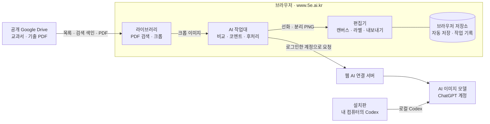
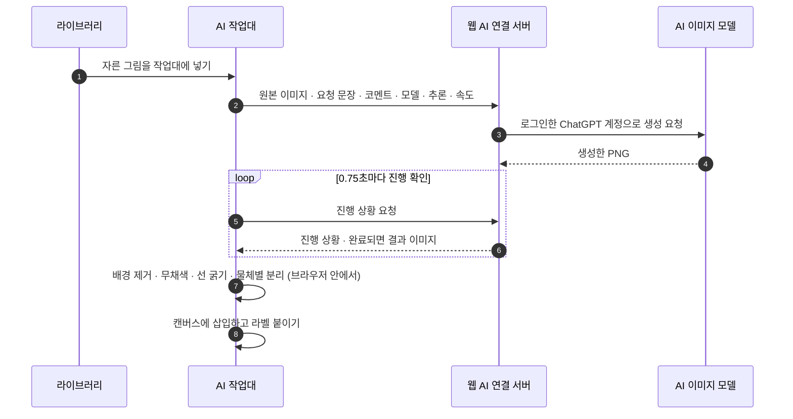

<p align="center">
  
</p>

<p align="center">
  <b>5E는 과학 교사를 위한 시험용 이미지 제작기입니다.</b><br>
  교과서·기출 PDF에서 그림을 잘라 AI로 평가원식 흑백 선화로 바꾸고, 다듬고 라벨을 붙여 바로 시험지에 넣습니다.
</p>

<p align="center">
  
  
  
</p>

<p align="center">
  <a href="https://www.5e.ai.kr/"></a>
  <a href="https://github.com/seungyeon980808-pixel/5E/releases/tag/v1.6.0"></a>
</p>

<p align="center">
  <br>
  <sub>16초 사용 영상 · <a href="docs/media/readme/5e-usage.mp4">고화질 MP4로 보기</a></sub>
</p>

<p align="center">
  <a href="#세-단계로-끝나는-시험용-그림">세 단계</a> ·
  <a href="#이런-그림을-만듭니다">결과 예시</a> ·
  <a href="#기능">기능</a> ·
  <a href="#시작하기">시작하기</a> ·
  <a href="#자주-묻는-질문">자주 묻는 질문</a> ·
  <a href="#구조-한눈에">구조</a> ·
  <a href="#내-데이터는-어디로-가나요">데이터</a> ·
  <a href="docs/RELEASE_NOTES_v1.6.0.md">1.6.0 변경 내용</a>
</p>

## 왜 5E인가요

시험지에 들어갈 그림 한 장을 만들려면 교과서를 스캔하고, 필요한 부분을 자르고, 그림판이나 일러스트 프로그램으로 선을 따고, 배경을 지우고, (가)(나)(다)를 붙이는 일을 여러 프로그램을 오가며 해야 했습니다. 5E는 이 과정을 **한 화면**에 모았습니다.

- **자료를 찾는 곳과 그리는 곳이 같습니다.** 교과서·기출 PDF를 검색해서 바로 자릅니다.
- **선을 직접 따지 않아도 됩니다.** AI가 평가원식 흑백 선화로 바꾸고, 마음에 안 드는 곳만 콕 집어 고칩니다.
- **시험지 규칙에 맞춥니다.** 배경 제거, 무채색, 선 굵기, 라벨 표기를 시험 그림 기준으로 정리합니다.
- **설치 없이 씁니다.** [5e.ai.kr](https://www.5e.ai.kr/)에서 바로 엽니다.

## 세 단계로 끝나는 시험용 그림

<table>
<tr>
<td width="42%" valign="middle">

### ① 라이브러리에서 이미지 크롭

교과서·기출 PDF를 **본문 글자까지** 검색하고, 문서 전체를 넘겨 보며 필요한 그림을 드래그로 자릅니다. 한 쪽에서 여러 영역을 자르고, 여러 PDF에서 자른 그림을 보관함에 모았다가 한 번에 작업대로 보냅니다.

</td>
<td width="58%"></td>
</tr>
<tr>
<td width="42%" valign="middle">

### ② AI 이미지 변환

사진과 컬러 그림을 **평가원식 흑백 선화**로 바꿉니다. 원본과 겹쳐 비교하고, 고치고 싶은 곳에 점이나 영역 코멘트를 남기면 그 부분만 다시 그립니다.

</td>
<td width="58%"></td>
</tr>
<tr>
<td width="42%" valign="middle">

### ③ 후처리 및 라벨링

배경을 지우고, 물체별로 나누고, 라벨러로 (가)(나)(다)와 지시선을 붙입니다. PNG·SVG로 내보내 시험지에 바로 넣습니다.

</td>
<td width="58%"></td>
</tr>
</table>

## 이런 그림을 만듭니다

모두 실제 교과서 그림을 5E로 변환한 결과입니다.

### 한 장에서 물체 10개까지

교과서의 물질 모음 그림 한 장을 선화로 바꾼 뒤, 배경을 지우고 물체별로 나눴습니다.


### 배경 유지와 배경 제거

같은 결과를 흰 배경 그대로, 또는 투명 배경으로 받을 수 있습니다.


### 여러 장치가 이어진 실험 순서

가열 → 온도 측정 → 거름처럼 장치가 이어진 그림도 구도와 순서를 그대로 유지합니다.


## 기능

### 라이브러리

| 기능 | 설명 |
|---|---|
| PDF 본문 검색 | 기출·교과서 PDF의 글자까지 검색하고, 일치한 쪽으로 바로 이동합니다 |
| 학년도 필터 | 기출을 학년도 범위로 좁힙니다 |
| 연속 읽기 | 검색한 PDF를 전체 문서로 이어 보며 쪽을 넘기거나 스크롤합니다 |
| 여러 영역 크롭 | 한 쪽에서 여러 영역을 자르고, 나중에 다시 조정합니다. 키보드로도 자를 수 있습니다 |
| 크롭 보관함 | 여러 PDF에서 자른 그림을 모아 한 작업으로 묶거나 작업별로 나눠 보냅니다 |
| 공유 자료 연결 | 공개 Google Drive 폴더를 연결해 학교·교과 협의회 자료를 함께 씁니다 |
| 그림·부품 검색 | 그림, 과학 부품, 개인 오브젝트를 같은 검색창에서 찾습니다 |

### AI 이미지 변환

| 기능 | 설명 |
|---|---|
| 평가원식 선화 변환 | 사진과 컬러 그림을 시험지용 흑백 선화로 바꿉니다 |
| 부분 수정 | 점·영역 코멘트를 남기면 그 부분만 고친 후보를 받아 비교 후 적용합니다 |
| 겹쳐 비교 | 원본과 결과를 나란히 두거나 경계선을 움직여 겹쳐 봅니다 |
| 여러 원본 한 작업 | 원본 여러 장을 함께 참고하게 하거나, 한 장씩 작업을 나눕니다 |
| 여러 작업 동시 실행 | 작업 여러 개를 한꺼번에 변환하고, 작업마다 경과 시간을 확인합니다 |
| 모델 선택 | GPT-6 Sol·Luna 등 사용할 모델과 사고 수준을 고릅니다 |
| 실패 기록 | 실패하면 상세 기록을 열어 확인하고 복사합니다 |
| 작업 공유 | 보기 전용 또는 편집 가능한 복사본 링크로 동료와 나눕니다 |

### 후처리와 라벨링

| 기능 | 설명 |
|---|---|
| 배경·색·선 굵기 | 드롭다운에서 고르면 바로 미리보기에 반영됩니다 |
| 물체별 분리 | 자동 감지·격자·직접 지정으로 그림을 물체별 투명 PNG로 나눕니다 |
| 라벨러 | 확대경, 최대 다섯 시작점 연결, 선과 글자 간격 조절 |
| 내보내기 | PNG·SVG, 내용에 맞춘 저장, 여러 결과 ZIP 내보내기 |

### 캔버스와 편집

| 기능 | 설명 |
|---|---|
| 그리기 도구 | 선·도형·텍스트·지시선·자유 그리기·자르기·지우개 |
| 과학 부품 | 비커·플라스크·회로 소자·용수철·전극·세포막·염색체·주기율표 등 |
| 그래프 | 좌표평면, 함수 그래프(불연속 구간 보존), 데이터 그래프 |
| Lite / Pro | 자주 쓰는 도구만 보는 Lite, 모든 도구를 쓰는 Pro |
| 저장과 복구 | 프로젝트 파일로 저장하고, 갑자기 닫혀도 자동 저장에서 복구합니다 |

## 시작하기

### 웹에서 바로

1. [5e.ai.kr](https://www.5e.ai.kr/)을 엽니다. 설치는 필요 없습니다.
2. 캔버스 아래의 **라이브러리**에서 교과서·기출 PDF를 검색하고, 필요한 그림을 잘라 **작업대에 넣기**를 누릅니다.
3. **AI 이미지 변환**에서 ChatGPT 계정으로 로그인하고 **변환**을 누릅니다.
4. 결과를 확인하고 **캔버스에 삽입**으로 가져와 라벨을 붙인 뒤 PNG·SVG로 내보냅니다.

### 설치판

1.6.0은 **웹으로 먼저 출시**합니다. 1.6.0 설치판(Windows·Mac)은 웹 버전 검증을 마친 뒤 PDF 폴더 연결 기능과 함께 따로 내놓을 예정입니다.

지금 받을 수 있는 설치판 최신 릴리즈 <strong>v1.5.8</strong>은 [릴리즈 페이지](https://github.com/seungyeon980808-pixel/5E/releases/tag/v1.5.8)에 있습니다. 설치판에는 1.6.0의 라이브러리와 AI 이미지 변환 작업대가 아직 들어 있지 않습니다.

### AI 연결

| 환경 | 연결 방식 |
|---|---|
| 웹 | AI 이미지 변환 창에서 ChatGPT 계정으로 기기 로그인 |
| 설치판 (1.6.0 준비 중) | 내 컴퓨터에 로그인된 Codex 사용 |

5E는 ChatGPT 비밀번호를 받지 않고, 웹에서는 로그인한 브라우저 탭에만 5E 세션 토큰을 둡니다([자세히](#내-데이터는-어디로-가나요)). AI 기능은 로그인한 계정의 기능과 이용 한도를 따르며, AI 연결 없이도 그리기와 편집은 모두 쓸 수 있습니다.

## 단축키

| 동작 | Windows | Mac |
|---|---|---|
| 실행 취소 / 다시 실행 | Ctrl+Z / Ctrl+Shift+Z | ⌘Z / ⌘⇧Z |
| 환경 설정 | Ctrl+, | ⌘, |
| 캔버스 확대·축소 | Ctrl + 휠 | ⌘ + 휠, 트랙패드 핀치 |
| 맨 위 창 닫기 | Esc | Esc |
| 크롭 영역 만들기 / 다음 영역 | Enter / Shift+Enter | Enter / Shift+Enter |

전체 단축키는 앱 안의 **단축키 도움말**에서 볼 수 있습니다.

## 자주 묻는 질문

<details>
<summary><b>AI 변환에 비용이 드나요?</b></summary>

5E 자체는 무료입니다. AI 변환은 로그인한 ChatGPT 계정의 기능과 이용 한도 안에서 실행됩니다.
</details>

<details>
<summary><b>변환 결과가 원본과 다르면 어떻게 하나요?</b></summary>

고치고 싶은 곳에 점이나 영역 코멘트를 남겨 부분 수정을 요청하세요. 요청하지 않은 부분은 그대로 보존합니다. AI 결과가 과학적 표현을 항상 정확히 지키지는 않으므로, 시험지에 넣기 전에 겹쳐 비교로 확인하세요.
</details>

<details>
<summary><b>물체별 분리는 벡터로 나뉘나요?</b></summary>

아니요. 이미지(래스터) 분리입니다. 각 물체가 투명 PNG로 나뉘며, 맞닿거나 겹친 물체는 함께 나뉠 수 있습니다.
</details>

<details>
<summary><b>작업은 어디에 저장되나요?</b></summary>

브라우저(또는 설치판) 안에 자동 저장되고, 원하면 프로젝트 파일로 내려받습니다. 웹과 설치판, 브라우저마다 저장 공간이 다르므로 옮길 때는 프로젝트 파일을 쓰세요.
</details>

<details>
<summary><b>교과서 그림을 써도 되나요?</b></summary>

교과서·기출 자료는 각 저작권자의 이용 조건을 따릅니다. 라이브러리에 자료가 보인다는 것이 이용 권리를 확인했다는 뜻은 아닙니다.
</details>

## 구조 한눈에

5E는 빌드 과정이 없는 정적 웹앱입니다. 편집기, 라이브러리, AI 작업대가 모두 브라우저 안에서 돌아가고, 서버가 필요한 일은 **AI 변환과 작업 공유 두 가지뿐**입니다. 그래서 AI를 쓰지 않으면 인터넷 연결이 끊겨도 그리기와 편집을 계속할 수 있습니다.


```mermaid
flowchart LR
  subgraph Browser["브라우저 · www.5e.ai.kr"]
    Library["라이브러리<br/>PDF 검색 · 크롭"]
    Workbench["AI 작업대<br/>비교 · 코멘트 · 후처리"]
    Editor["편집기<br/>캔버스 · 라벨 · 내보내기"]
    Store[("브라우저 저장소<br/>자동 저장 · 작업 기록")]
  end
  Drive["공개 Google Drive<br/>교과서 · 기출 PDF"]
  Relay["웹 AI 연결 서버"]
  Desktop["설치판<br/>내 컴퓨터의 Codex"]
  Model["AI 이미지 모델<br/>ChatGPT 계정"]

  Drive -->|목록 · 검색 색인 · PDF| Library
  Library -->|크롭 이미지| Workbench
  Workbench -->|선화 · 분리 PNG| Editor
  Editor --- Store
  Workbench -->|로그인한 계정으로 요청| Relay
  Relay --> Model
  Desktop -->|로컬 Codex| Model
```

| 구성 요소 | 하는 일 | 어디서 실행되나 |
|---|---|---|
| 편집기 | 그리기 도구, 과학 부품, 그래프, 라벨러, PNG·SVG 내보내기 | 브라우저 |
| 라이브러리 | PDF 본문 검색, 연속 읽기, 여러 영역 크롭, 크롭 보관함 | 브라우저 (PDF는 공개 Google Drive에서 필요할 때 받음) |
| AI 작업대 | 변환 요청, 결과 비교, 점·영역 코멘트, 배경 제거·무채색·선 굵기, 물체별 분리 | 브라우저 (변환만 AI 모델) |
| 웹 AI 연결 서버 | ChatGPT 기기 로그인, 변환 요청 전달, 작업 공유 링크 보관 | 클라우드 서버 |
| 설치판 | 같은 편집기를 데스크톱 창으로 실행하고, 내 컴퓨터에 로그인된 Codex로 변환 | 내 컴퓨터 |

## AI 이미지 변환은 이렇게 흘러갑니다


```mermaid
sequenceDiagram
  autonumber
  participant L as 라이브러리
  participant W as AI 작업대
  participant R as 웹 AI 연결 서버
  participant M as AI 이미지 모델
  L->>W: 자른 그림을 작업대에 넣기
  W->>R: 원본 이미지 · 요청 문장 · 코멘트 · 모델 · 추론 · 속도
  R->>M: 로그인한 ChatGPT 계정으로 생성 요청
  M-->>R: 생성한 PNG
  loop 0.75초마다 진행 확인
    W->>R: 진행 상황 요청
    R-->>W: 진행 상황 · 완료되면 결과 이미지
  end
  W->>W: 배경 제거 · 무채색 · 선 굵기 · 물체별 분리 (브라우저 안에서)
  W->>W: 캔버스에 삽입하고 라벨 붙이기
```

- **요청에 들어가는 것**: 작업대에 넣은 원본 이미지(한 작업에 최대 8장), 변환 규칙이 담긴 요청 문장, 내가 남긴 점·영역 코멘트, 고른 모델과 추론·속도 설정.
- **결과 받기**: 브라우저가 0.75초마다 진행 상황을 묻고, 완료되면 PNG를 받습니다. 실패해도 **자동으로 다시 요청하지 않습니다.** 원본과 코멘트는 그대로 남아 있어 바로 다시 변환할 수 있습니다.
- **후처리는 브라우저 안에서**: 배경 제거, 무채색, 선 굵기, 물체별 분리는 받은 이미지를 브라우저에서 픽셀 단위로 처리합니다. 설정을 바꿔도 AI를 다시 부르지 않습니다.
- **모델 목록은 계정마다 다릅니다**: **생성 모델** 목록은 고정되어 있지 않고, 로그인한 계정이 쓸 수 있는 모델을 서버에서 받아 옵니다. 추론(최소 · 가장 빠름 / 낮음 · 빠름 / 보통 / 높음 · 정밀 / 매우 높음 / 최대 / 울트라)과 속도(표준 / 빠름 / 유동)도 모델이 지원하는 것만 보입니다.

| 출력 옵션 | 선택지 |
|---|---|
| 이미지 구성 | 한 장 · 물체별 분리 |
| 배경 | 원본 유지 · 외부 배경 제거 · 모든 흰색 제거 |
| 색상 | 원본 색상 · 무채색 |
| 선 굵기 | 원본 · +1px · +2px |
| 객체 분리 | 사용 안 함 · 자동 감지 · 격자 기준 · 직접 지정 |

## 내 데이터는 어디로 가나요

| 데이터 | 어디에 저장되나 | 밖으로 나가나 |
|---|---|---|
| 편집 중인 작업 | 브라우저 IndexedDB 자동 저장 (최근 8개) | 나가지 않습니다 |
| 프로젝트 파일 | 내가 내려받은 `.5e` 파일 (UTF-8 JSON) | 직접 옮길 때만 |
| 크롭·AI 작업·결과 | 브라우저 IndexedDB | 변환을 누를 때 원본과 코멘트만 웹 AI 연결 서버로 |
| 웹 AI 로그인 | 브라우저 탭의 sessionStorage에 5E 세션 토큰 하나 | ChatGPT 인증 정보는 서버의 임시 공간에만 있고, 30분 동안 쓰지 않으면 끝납니다 |
| 작업 공유 | 서버 임시 저장소, **1시간 뒤 만료** | 링크를 받은 사람만 열 수 있고, **공유 중지**로 바로 지울 수 있습니다 |
| 설치판 AI | 내 컴퓨터의 Codex 로그인 | 내 컴퓨터에서 AI 서비스로 바로 |

- 5E는 ChatGPT 비밀번호를 받지 않습니다. 로그인은 OpenAI 인증 창에서 기기 인증 코드로 합니다.
- 서버가 다시 시작되면 로그인과 공유 링크가 사라질 수 있습니다. 이때는 다시 로그인하면 됩니다.
- 공유 문서에는 원본, 크롭, 생성 버전, 작업 설정이 담기고, 로그인 쿠키와 인증 정보는 담기지 않습니다.

<details>
<summary><b>폴더 구조</b></summary>

```text
5E/
├── index.html · css/ · js/   루트 편집기 (1.5 계열 소스)
├── preview/                  1.6 편집기 소스 · 웹 1.6.0과 설치판이 이 편집기를 씁니다
│   ├── js/                   편집기 · 라이브러리 · AI 작업대 모듈
│   │   ├── render/  inspector/  tools/  function-graph/  graph/
│   │   ├── library/  pdf-library/          라이브러리 · PDF 검색 · 크롭
│   │   └── ai-*.js  web-ai-*.js  image-background*.js   AI 작업대 · 후처리
│   └── vendor/               pdf.js · OCR
├── desktop/                  Electron 설치판 (main · preload · 로컬 Codex 연결 · 보안 정책)
├── tools/mcp-5e/             AI 에이전트 연동 MCP 서버
├── tests/                    단위 · 브라우저 테스트 · 테스트 자료
├── scripts/                  로컬 서버 · 배포 검사
├── docs/                     사용 가이드 · 설계 문서 · 릴리즈 기록
├── assets/  fonts/           아이콘 · 과학 부품 · 수식 글꼴(LM Roman)
└── .github/workflows/        테스트 · 배포 검사 · 설치판 빌드
```

주요 모듈:

| 영역 | 파일 |
|---|---|
| 시작점 · 상태 | `preview/js/main.js` · `state.js` · `transform.js` (실행 취소) · `pages.js` |
| 화면 그리기 | `preview/js/render.js` · `render/` |
| 속성 패널 | `preview/js/inspector.js` · `inspector/` |
| 라이브러리 | `preview/js/unified-library-ui.js` · `pdf-library/` · `library/` |
| AI 작업대 | `preview/js/ai-panel.js` · `ai-workbench.js` · `web-ai-connection.js` |
| 후처리 · 분리 | `preview/js/image-background-process.js` · `ai-separated-assets.js` |
| 저장 · 복구 | `preview/js/project-io.js` · `autosave.js` · `idb-store.js` |
| 내보내기 | `preview/js/svg-export.js` · `export-dialog.js` |

모든 모듈은 브라우저 기본 ES 모듈이라 번들러가 없습니다. 브라우저가 옛 파일을 쓰지 않도록 가져오는 주소에 `?v=` 버전 값을 붙입니다. 데이터가 진실이고 SVG 화면은 그 데이터를 그린 결과라는 설계 원칙은 [DESIGN.md](DESIGN.md)에 있습니다.

</details>

<details>
<summary><b>개발과 테스트</b></summary>

필요한 것: [Node.js 24.21.x](.nvmrc) (`>=24.21.0 <25`)

```sh
git clone https://github.com/seungyeon980808-pixel/5E.git
cd 5E
npm ci
npx playwright install chromium webkit   # 브라우저 테스트용
```

**화면만 띄우기** — 정적 파일이라 아무 정적 서버나 됩니다.

```sh
python3 -m http.server 8000                 # http://localhost:8000/preview/
node scripts/preview-local-server.cjs       # http://127.0.0.1:8795/preview/ · 웹 AI 로그인까지 시험
```

두 번째 서버는 파일을 보여 주는 동시에, 웹 AI 로그인과 변환 요청을 공개 웹 AI 연결 서버로 넘겨 줍니다. 로컬에서 AI 변환까지 시험할 때 씁니다.

| 명령 | 하는 일 |
|---|---|
| `npm test` | 단위 테스트 (Node 테스트 러너) |
| `npm run test:browser` | 로컬 서버를 띄우고 Chromium·WebKit 브라우저 테스트 (`--only` · `--list` 지원) |
| `npm run test:smoke-contract` | 배포 전 확인 항목 검사 |
| `npm run verify:release-identity` | 버전 · 태그 · 설치 파일 이름이 서로 맞는지 확인 |
| `npm run audit:exam-motifs` | 평가원 도식 모티프 목록 검사 |
| `npm run desktop` | 설치판을 개발 모드로 실행 |
| `npm run test:desktop` · `test:image` | 임시 프로필로 설치판 스모크 테스트 · 실제 이미지 생성까지 |
| `npm run build:unpacked` | 설치 전 형태로 빌드 |
| `npm run package:win` · `package:mac` | Windows NSIS 설치 파일 · macOS DMG·ZIP (게시하지 않음) |

GitHub Actions:

| 워크플로 | 언제 | 하는 일 |
|---|---|---|
| Test | 모든 push · PR | 단위 테스트 + 브라우저 테스트 |
| Release Identity | 모든 push · PR | 버전 정보 일치 검사 |
| Desktop Release | `v*` 태그 | 테스트 → Windows·macOS 빌드 → 출시 보류 검사 → 체크섬 → **초안** 릴리즈 |

설치판 개발 문서: [Windows](docs/DESKTOP_WINDOWS.md) · [macOS](docs/DESKTOP_MACOS.md) · [코드 서명 정책](docs/CODE_SIGNING_POLICY.md)

</details>

<details>
<summary><b>배포 채널</b></summary>

| 주소 | 버전 | 용도 |
|---|---|---|
| [www.5e.ai.kr](https://www.5e.ai.kr/) | 1.6.0 | 정식 웹 버전 |
| [www.5e.ai.kr/1.6.0/](https://www.5e.ai.kr/1.6.0/) | 1.6.0 | 버전을 고정한 주소 |
| [www.5e.ai.kr/mobile/](https://www.5e.ai.kr/mobile/) | 1.6.0 Mobile Preview | 모바일 미리보기 |
| [www.5e.ai.kr/preview/](https://www.5e.ai.kr/preview/) | 1.7.0 Preview | 다음 버전 미리보기 |
| [GitHub Releases](https://github.com/seungyeon980808-pixel/5E/releases) | 설치판 1.5.8 | Windows 설치판 (1.6.0 설치판은 준비 중) |

- 웹사이트는 GitHub Pages로 배포합니다. 배포용 브랜치의 저장소 루트를 그대로 올립니다.
- 1.6.0은 웹을 먼저 출시했습니다. 설치판은 서명·실기기 검증 등 [출시 보류 항목](docs/RELEASE_HOLD.md)을 모두 풀어야 게시합니다.
- 문제가 생기면 기록해 둔 정상 버전으로 되돌립니다. 이미 올린 설치 파일은 바꿔치기하지 않고 새 패치 버전을 냅니다. 자세한 절차는 [되돌리기 절차](docs/RELEASE_ROLLBACK.md)에 있습니다.
- 채널 기록: [RELEASE_CHANNELS.md](docs/RELEASE_CHANNELS.md) · [release-channels.json](release-channels.json) · [GitHub 릴리즈 절차](docs/GITHUB_RELEASES.md)

</details>

<details>
<summary><b>문제 해결</b></summary>

<details>
<summary>로그인 창이 열리지 않아요</summary>

**"인증 팝업이 차단되었습니다"** 가 보이면 브라우저 주소창에서 5e.ai.kr의 팝업을 허용하고 **2. OpenAI 인증하기 →** 를 다시 누르세요. 인증 창에는 **1. 인증 코드 복사** 로 복사한 코드를 붙여 넣습니다.
</details>

<details>
<summary>"로그인 시간이 만료되었거나 연결이 끊겼습니다"</summary>

로그인을 시작하고 10분 안에 인증을 마치지 않았거나, 30분 넘게 쓰지 않아 연결이 끝난 경우입니다. 서버가 다시 시작되어도 이 문구가 나옵니다. **다시 로그인** 을 누르고 새 코드로 인증하세요.
</details>

<details>
<summary>변환에 실패했어요</summary>

**"변환에 실패했습니다. 입력과 코멘트는 보존되었습니다."** 가 나오면 원본과 코멘트가 그대로 남아 있으니 바로 다시 변환할 수 있습니다. 원인은 AI 작업대 위쪽의 **로그 보기** 에서 확인합니다. 작업·요청·모델별 오류가 시간순으로 쌓이고, **로그 복사** 로 한 번에 복사할 수 있습니다. 인증 정보와 이미지 데이터는 로그에 남지 않습니다.
</details>

<details>
<summary>원하는 모델이 목록에 없거나 "사용할 수 없음"으로 보여요</summary>

모델 목록은 로그인한 계정이 쓸 수 있는 것만 보여 줍니다. 전에 고른 모델이 지금 계정에서 안 되면 **(모델 이름) · 사용할 수 없음** 으로 표시됩니다. **모델 목록 새로고침** 을 누른 뒤 다시 고르세요. 변환 중에는 모델·추론·속도를 바꿀 수 없습니다.
</details>

<details>
<summary>라이브러리에 PDF가 보이지 않아요</summary>

웹 버전은 기본 제공 자료(공개 Google Drive 폴더)를 자동으로 연결합니다. **"제공 자료 연결 실패"** 가 보이면 네트워크를 확인하고 **다시 시도** 를 누르세요. 다른 공개 폴더는 **Google Drive 연결** 로 추가할 수 있습니다. **내 컴퓨터 폴더 연결** 은 설치판이 필요합니다.
</details>

<details>
<summary>결과에 흰 배경이 남아요</summary>

**배경** 에서 **외부 배경 제거** 를 고르면 그림 바깥의 흰 배경만 지웁니다. **모든 흰색 제거** 는 그림 안쪽의 흰 영역까지 투명하게 만듭니다. 결과는 바로 미리보기에 반영되고 AI를 다시 부르지 않습니다.
</details>

<details>
<summary>물체별 분리가 원하는 대로 나뉘지 않아요</summary>

분리는 서로 떨어진 물체를 중심으로 작동합니다. 맞닿거나 겹친 물체는 함께 나뉠 수 있습니다. **객체 분리** 를 **격자 기준** 이나 **직접 지정** 으로 바꿔 보세요. 분리는 투명 PNG로 나누는 이미지 분리이고, 내부 선을 벡터로 바꾸지는 않습니다.
</details>

<details>
<summary>"자동 저장에 실패했습니다"</summary>

브라우저 저장 공간이 부족할 때 나올 수 있습니다. 5E가 자동으로 다시 시도하지만, 작업이 끝나면 **프로젝트 파일로도 저장** 해 두세요. 다음에 열 때 **작업 복구** 창에서 **복구** 를 누르면 이전 작업을 되살립니다.
</details>

</details>

<details>
<summary><b>AI 에이전트 연동 (MCP)</b></summary>

Claude 같은 AI 에이전트가 열려 있는 5E 편집기에 회로, 그래프, 과학 부품을 직접 그려 넣게 할 수 있습니다. [tools/mcp-5e](tools/mcp-5e/)는 의존성 없는 MCP 서버(Node 18 이상)입니다.

```sh
claude mcp add 5e -- node "/절대경로/5E/tools/mcp-5e/server.js"
claude mcp list
```

1. 편집기를 로컬 서버(`http://localhost:…/preview/`)로 엽니다. 배포 주소에서는 주소 끝에 `?mcp=1`을 붙여 한 번 켭니다(끄기: `?mcp=0`).
2. 에이전트에게 연결을 요청하면 `app_pairing`이 연결 코드(`mcp-5e://127.0.0.1:포트/#…`)를 줍니다.
3. 편집기 상단의 **MCP** 배지를 눌러 코드를 붙여 넣고, `app_status`로 연결된 창을 확인합니다.

주요 도구: `add_circuit` · `add_graph` · `add_part` · `add_field_region` · `add_incline_scene` · `read_app` · `export_image` · `save_project` 등 26개

- MCP 서버는 내 컴퓨터(127.0.0.1)에서만 열리고, 실행할 때마다 새로 만드는 연결 코드가 있어야 명령을 받습니다.
- 한 번에 편집기 창 하나만 연결되고, 다른 창으로 옮기려면 직접 넘겨야 합니다.
- 현재 연결을 허용하는 주소는 로컬 서버와 GitHub Pages 기본 주소입니다. **www.5e.ai.kr에서의 연결은 아직 지원하지 않습니다.**

</details>

<details>
<summary><b>설계 문서</b></summary>

| 문서 | 내용 |
|---|---|
| [DESIGN.md](DESIGN.md) | 아키텍처 결정과 근거: 데이터 중심 상태, viewBox 좌표계, 저장 구조 |
| [OBJECT_SCHEMA.md](docs/OBJECT_SCHEMA.md) | 오브젝트 데이터 형식 |
| [IMAGE_OBJECT_SEAM_CONTRACT.md](docs/IMAGE_OBJECT_SEAM_CONTRACT.md) | 이미지에서 오브젝트로 넘길 때의 약속 |
| [EXAM_SCIENTIFIC_DIAGRAM_STYLE.md](docs/EXAM_SCIENTIFIC_DIAGRAM_STYLE.md) | 평가원식 과학 도식 스타일 규칙 |
| [FIGURE_DESIGN_PRINCIPLES.md](docs/FIGURE_DESIGN_PRINCIPLES.md) | 그림 재현·배치·글꼴 원칙 |
| [IMAGE_COMPLEXITY_MODE_SPEC.md](docs/IMAGE_COMPLEXITY_MODE_SPEC.md) | 이미지 변환 복잡도 모드 |
| [EXAM_LIBRARY_SPEC_20260706.md](docs/EXAM_LIBRARY_SPEC_20260706.md) | 기출 라이브러리 검색·이름 규칙 |
| [GPT_KNOWLEDGE_EVALUATION_SCIENCE_LINEART.md](docs/GPT_KNOWLEDGE_EVALUATION_SCIENCE_LINEART.md) | 평가원식 선화 변환 지식 |
| [docs/engine-v2/](docs/engine-v2/) | 도식 엔진 V2 안내 |
| [docs/audits/](docs/audits/) | 릴리즈 전 점검 기록 |

</details>

## 문서

- [1.6.0 변경 내용](docs/RELEASE_NOTES_v1.6.0.md)
- [사용 가이드](docs/USER_GUIDE.md)
- [릴리즈 이력](https://github.com/seungyeon980808-pixel/5E/releases)
- [이미지 출처](docs/credits.html)

## 버그 제보와 기여

- 문제를 발견하면 [GitHub Issues](https://github.com/seungyeon980808-pixel/5E/issues)에 남겨 주세요. **사용한 주소(웹/설치판), 브라우저, 어떤 순서로 무엇을 했는지**, 가능하면 **로그 보기** 에서 복사한 내용을 함께 적어 주시면 빨리 고칠 수 있습니다.
- 교과서·기출 이미지를 올릴 때는 저작권에 주의해 주세요.
- 코드를 고쳐 보내실 때는 `npm test`와 `npm run test:browser`가 통과하는지 확인해 주세요.

## 라이선스

5E는 [GNU AGPL v3](LICENSE)로 배포됩니다. 수정한 버전을 배포하거나 웹 서비스로 제공할 때는 소스 코드를 공개해야 합니다.

개발 박승연 (SMOE) · Copyright © 2026 박승연

