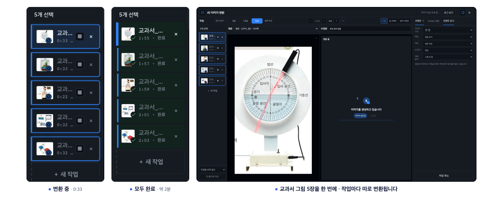
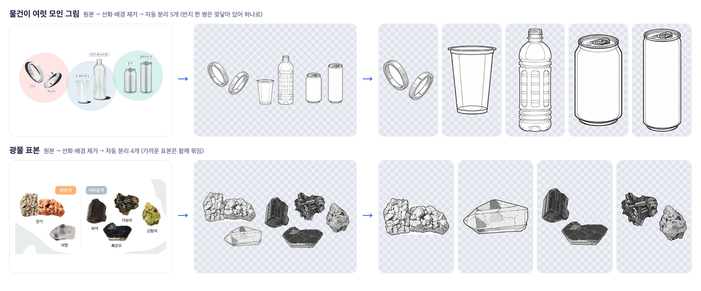
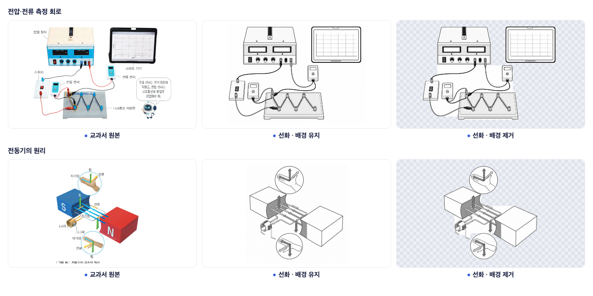
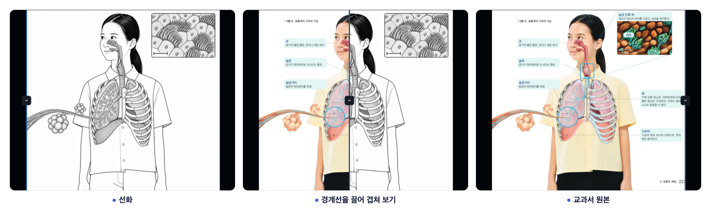

# 5E 1.6.0 전체 사례

[README의 암석·심장·물체 10개 분리 사례](../README.md#이런-그림을-만듭니다)와 함께 볼 수 있는 전체 사례입니다. 모두 실제 중학교 과학 2 교과서 그림으로 만든 결과입니다.

## 여러 종류의 교과서 그림과 동시 변환

실험 장치·생물·회로·암석

교과서 그림 8장을 각각의 작업으로 나누어 동시에 요청했습니다. 이 사례에서는 8장 모두 약 2분 만에 끝났으며, 손으로 고치지 않은 AI 결과입니다.

2026-09-30 제작 기록 · GPT-6-Astra · 사고 수준 낮음(low) · 작업별 약 67~102초. 여러 작업을 동시에 요청한 사례이며, 모델·이미지·서버 대기 상황에 따라 달라집니다.

그림마다 작업과 경과 시간이 따로 표시됩니다. 변환이 끝난 작업부터 확인할 수 있습니다.

## 물체별 분리 결과

한 장에서 나눈 물체 10개와 다른 사례

README에 소개한 주스가 포함된 물질 모음 그림에서 나눈 물체 10개입니다.

물체가 여럿 모인 다른 그림도 같은 방식으로 나눕니다. 맞닿은 물체는 하나로 묶일 수 있어서, 분리 결과 확인 창에서 영역을 고친 뒤 캔버스에 넣습니다.

## 배경 유지와 배경 제거

비커·회로·전동기

같은 결과를 흰 배경 그대로, 또는 투명 배경으로 받을 수 있습니다.

## 심장에 라벨 붙이기

심장·호흡계

선화에 (가)(나)(다)와 지시선을 붙여 시험용 그림으로 정리합니다.

경계선을 좌우로 끌어 선화와 교과서 원본을 한 화면에서 겹쳐 봅니다. 원본의 물체 수·배치·과학적 표현을 확인한 뒤 사용하세요.

### 원본과 겹쳐 비교

## 실험 순서의 변환

가열 → 온도 측정 → 거름 예시입니다. 이 사례에서는 원본의 구도와 순서를 유지했습니다. 다른 그림의 결과도 물체 수·배치·과학적 표현을 비교한 뒤 사용하세요.

## PDF에서 필요한 그림 자르기

[1.6.0 웹 사용 가이드](USER_GUIDE_v1.6.0.md) · [README로 돌아가기](../README.md)
