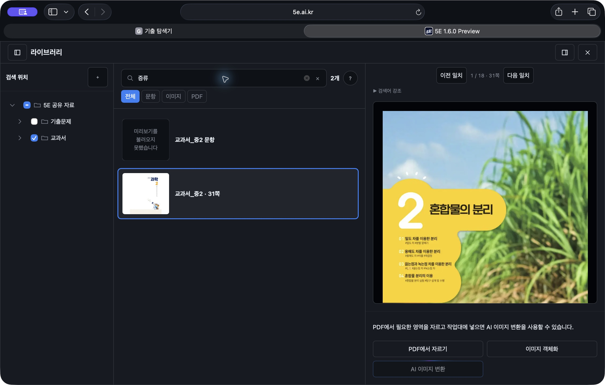
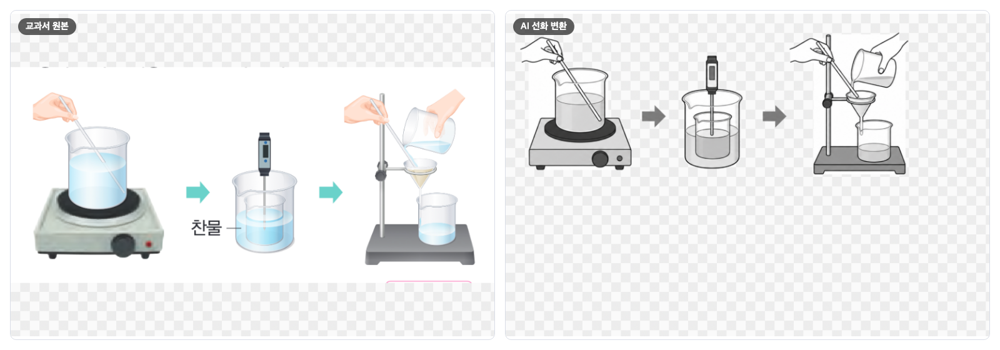
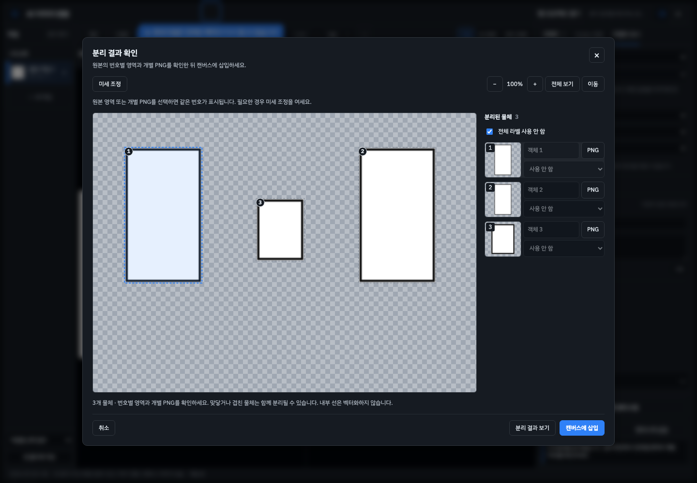

# 5E v1.6.0 — 어떤 그림이든, 시험용 그림으로

> **라이브러리에서 이미지 크롭 → AI 이미지 변환 → 후처리 및 라벨링.**
> 교과서·기출 PDF에서 그림을 찾아 자르고, AI로 평가원식 흑백 선화로 바꾸고, 다듬고 라벨을 붙여 시험지에 넣는 과정을 한 프로그램 안에서 끝냅니다.

v1.5.x의 5E가 “그림을 직접 그리는 편집기”였다면, v1.6.0은 **자료를 찾는 순간부터 시험지에 넣는 순간까지**를 한 흐름으로 다룹니다. 이를 위해 PDF 라이브러리와 AI 이미지 변환 작업대를 새로 만들었고, 캔버스·저장·복구·웹 로그인·데스크톱까지 전반을 다시 다듬었습니다. 약 3주 동안 기능 추가 30여 건, 수정 120여 건이 들어간 가장 큰 업데이트입니다.

## 목차

- [한눈에 보기](#한눈에-보기)
- [1단계 · 라이브러리에서 이미지 크롭](#1단계--라이브러리에서-이미지-크롭)
- [2단계 · AI 이미지 변환](#2단계--ai-이미지-변환)
- [3단계 · 후처리 및 라벨링](#3단계--후처리-및-라벨링)
- [편집 화면과 캔버스](#편집-화면과-캔버스)
- [Lite와 Pro](#lite와-pro)
- [작업 보존과 복구](#작업-보존과-복구)
- [저장과 내보내기](#저장과-내보내기)
- [웹에서 AI 쓰기](#웹에서-ai-쓰기)
- [데스크톱 앱](#데스크톱-앱)
- [튜토리얼](#튜토리얼)
- [안정성·성능·보안](#안정성성능보안)
- [알려진 제한](#알려진-제한)
- [업데이트 전에](#업데이트-전에)

## 한눈에 보기

| 단계 | 새로 할 수 있게 된 일 |
|---|---|
| **1. 라이브러리에서 이미지 크롭** | 교과서·기출 PDF 본문 검색 · 전체 문서 연속 읽기 · 한 쪽에서 여러 영역 크롭 · 크롭 보관함 · Google Drive 공유 자료 · 학년도 필터 |
| **2. AI 이미지 변환** | 평가원식 흑백 선화 변환 · 점·영역 코멘트로 부분 수정 · 원본과 겹쳐 비교 · 여러 작업 동시 실행 · 모델·사고 수준 선택 · 실패 기록 보기 |
| **3. 후처리 및 라벨링** | 배경 제거·무채색·선 굵기 · 물체별 분리 · 투명 PNG 삽입 · 라벨러 확대경과 다중 시작점 · PNG·SVG·ZIP 내보내기 |
| **작업 보존** | 모드 전환 시 이어하기/새로 시작 선택 · 새 작업 전 복구 보관 · 페이지별 실행 취소 · 복구 창 “나중에 결정” |
| **웹과 데스크톱** | ChatGPT 기기 로그인 · GPT-6 Sol·Luna 모델 · 작업 공유 링크 · macOS 패키지 · 앱 권한 보호 |

---

## 1단계 · 라이브러리에서 이미지 크롭

그림·과학 부품·개인 오브젝트·PDF를 **하나의 라이브러리**에서 찾고, 필요한 부분을 잘라 캔버스나 AI 작업대로 보냅니다.

### 찾기

- **통합 검색** — 그림, 과학 부품, 개인 오브젝트, PDF를 한 검색창에서 찾습니다. 전체·문항·이미지·PDF 탭으로 좁힙니다.
- **PDF 본문 검색** — 파일 이름뿐 아니라 **본문 글자까지** 검색합니다. 결과는 파일 단위로 묶이고, 일치한 쪽 수와 위치가 함께 표시됩니다.
- **일치 위치 이동** — “이전 일치 / 다음 일치”로 검색어가 나온 쪽을 차례로 오갑니다.
- **학년도 범위** — 기출을 학년도 구간으로 좁힙니다. 파일명 속 연도 인식을 보완했습니다.
- **공유 자료 연결** — 공개 Google Drive 폴더를 연결합니다. 파일 목록과 검색 색인을 먼저 읽고, PDF 원문은 필요할 때만 가져와 빠르게 열립니다.
- **내 컴퓨터 폴더** — 설치형 5E에서는 로컬 폴더를 라이브러리에 연결합니다.
- **단계적 불러오기** — 결과 카드를 스크롤에 맞춰 나눠 불러와, 자료가 수백 개인 폴더도 바로 열립니다.
- **색인 재사용** — 한 번 만든 검색 색인을 저장해 다음 실행부터 즉시 검색하고, 오래 걸리는 색인 작업은 도중에 취소할 수 있습니다.
- **선택 유지** — 필터를 바꿔도 체크해 둔 크롭 대상이 풀리지 않습니다.

### 읽기

- **전체 문서 연속 읽기** — 검색으로 연 PDF도 문서 전체를 이어서 봅니다. 스크롤하거나 ‹ › 버튼, 키보드로 쪽을 넘깁니다.
- **흔들림 없는 쪽 넘김** — 빠르게 넘겨도 늦게 도착한 이전 쪽이 현재 화면을 덮어쓰지 않습니다. 흐린 미리보기가 선명한 화면으로 바뀔 때 쪽이 되돌아가던 현상도 줄였습니다.
- **긴 교과서도 가볍게** — 300쪽이 넘는 교과서를 내려가도 **보고 있는 쪽 주변만 메모리에 두어** 느려지지 않습니다.
- **로딩 안내** — 쪽을 불러오는 동안 진행 상태를 보여 주고, 실패한 쪽은 그 자리에서 다시 시도합니다.
- **미리보기 정렬** — PDF 미리보기의 위치와 비율을 원본 쪽과 정확히 맞췄습니다.

### 자르기

- **여러 영역 크롭** — 한 쪽에서 여러 영역을 연달아 자르고, 추가하기 전에 미리보기로 확인합니다.
- **다시 조정** — 이미 자른 영역을 다시 열어 위치와 크기를 고칩니다.
- **확대·맞춤** — 크롭 화면을 확대·축소하고 “좌우 맞춤”으로 쪽 너비에 맞춥니다. Ctrl/⌘ + 휠이나 트랙패드 핀치로도 확대합니다.
- **확대경** — 경계를 정확히 맞추도록 포인터 주변을 크게 보여 줍니다. 라이브러리에서는 기본으로 꺼져 있고, 필요할 때 켭니다.
- **키보드로 자르기** — Enter로 첫 영역을 만들고, 화살표로 옮기고, Shift+화살표로 크기를 바꿉니다. 다음 영역은 Shift+Enter, 추가는 Enter·Space입니다. 화면 읽기 프로그램에 영역 크기와 위치를 알려 줍니다.
- **문항에서 바로 크롭** — 문항을 고르면 크롭 화면을 먼저 열고 준비 상태를 표시해, 기다리는 시간이 줄었습니다.
- **크롭 보관함** — 여러 PDF, 여러 쪽에서 자른 그림이 보관함에 모입니다. 한 작업으로 묶어 보낼 그림과 작업별로 나눠 보낼 그림을 고릅니다.
- **확실한 전달** — 작업대가 받았다고 확인한 그림만 보관함에서 정리합니다. 실패한 그림은 남아 다시 보낼 수 있습니다.
- **빈 작업대 재사용** — 라이브러리에서 보낸 그림은 비어 있는 첫 작업대를 먼저 씁니다. 빈 작업대가 쌓이던 문제를 고쳤습니다.
- **바로 내보내기** — 자른 그림을 작업대를 거치지 않고 캔버스에 넣거나 파일로 저장합니다.

## 2단계 · AI 이미지 변환

자른 그림을 AI로 평가원식 흑백 선화로 바꾸고, 원본과 비교하며 필요한 부분만 고칩니다.

### 변환

- **평가원식 선화 변환** — 교과서 사진과 컬러 그림을 시험지용 흑백 선화로 바꿉니다. 한 번 요청으로 완성된 PNG를 받습니다.
- **명시적 실행** — 원본을 넣어도 바로 변환하지 않고, “변환”을 눌렀을 때만 실행해 원치 않는 사용을 막습니다.
- **여러 원본 한 작업** — 원본 여러 장을 한 작업에 넣어 함께 참고하게 하거나, 한 장씩 별도 작업으로 나눕니다. 원본의 역할(원본·표현 참고)과 순서를 정할 수 있습니다.
- **캔버스에서 가져오기** — 캔버스에서 선택한 이미지를 그대로 작업대로 보냅니다.
- **실행 전 보관** — 변환을 요청하기 직전에 작업을 저장해, 도중에 창이 닫혀도 요청과 원본이 남습니다.

### 부분 수정

- **점·영역 코멘트** — 결과 위에 점을 찍거나 영역을 그려 “이 부분의 선을 더 굵게” 같은 요청을 남깁니다.
- **수정 후보 비교** — 고친 후보를 받아 원래 결과와 비교한 뒤 적용하거나 버립니다. 요청하지 않은 부분은 픽셀 단위로 보존합니다.
- **코멘트 패널** — 오른쪽 패널에서 코멘트를 모아 보고, 캔버스의 표시와 서로 연결해 확인합니다.
- **입력 보존** — 실패하거나 저장 공간이 부족해도 입력한 요청과 코멘트는 그대로 남습니다.

### 비교

- **나란히 보기 / 겹쳐 보기** — 원본과 결과를 좌우로 두거나, 경계선을 끌어 한 화면에서 겹쳐 봅니다.
- **같은 기준 위치** — 크기와 비율이 다른 이미지도 같은 기준에 맞춰 보여 줍니다. 물체별 분리 뒤에도 상대 위치와 크기가 유지됩니다.
- **연동 확대** — 양쪽 이미지를 함께 확대·이동합니다. Ctrl + 휠, 트랙패드 핀치를 지원합니다.
- **투명 배경 표시** — 투명한 부분은 어두운 체크무늬로 보여 줘, 흰 선과 빈 곳을 구분합니다.
- **원본·수정본 고르기** — “원본”과 “수정본” 옆 드롭다운에서 비교할 이미지를 이름으로 고릅니다.

### 여러 작업

- **동시 실행** — 여러 작업을 골라 한꺼번에 변환합니다. 전송 용량에 맞춰 한 번에 보낼 이미지 수를 조절합니다.
- **경과 시간** — 작업마다 실행 시간과 대기 순서가 보입니다. 서버가 붐빌 때는 “서버 전체 N번째”로 대기 순서를 알려 줍니다.
- **정확한 결과 연결** — 변환 중 다른 작업이나 페이지로 옮겨도, 결과는 실행을 시작한 작업으로 돌아옵니다.
- **작업 정리** — 대기 중인 작업을 한 번에 비우고, 삭제한 작업이 목록에 남거나 되살아나던 문제를 고쳤습니다.
- **중단 후 재시도** — 도중에 끊긴 작업은 “다시 시도”로 이어서 실행합니다.

### 모델과 기록

- **모델 선택** — 연결된 서버가 제공하는 모델(GPT-6 Sol·Luna 포함) 중에서 고르고, 사고 수준과 속도를 정합니다.
- **호환 설정 자동 정리** — 모델을 바꿀 때 맞지 않는 설정은 기본값으로 돌아갑니다.
- **실패 기록** — 실패하면 “로그 보기”로 상세 기록을 열고 복사합니다. 인증 정보는 지운 채 보여 줍니다.
- **중복 알림 정리** — 같은 실패가 여러 번 겹쳐 뜨던 알림을 하나로 합쳤습니다.

### 공유

- **작업 공유 링크** — 작업을 보기 전용 또는 편집 가능한 복사본으로 공유합니다. 받은 사람이 고쳐도 원본 작업은 바뀌지 않고, 만든 링크는 언제든 중지할 수 있습니다.

## 3단계 · 후처리 및 라벨링

### 후처리

- **배경 제거·색·선 굵기** — 배경(원본 유지·제거), 색상(원본·무채색), 선 굵기를 드롭다운에서 고르면 **바로 미리보기에 반영**되고, 캔버스에 넣을 때도 같은 설정이 적용됩니다.
- **애매한 배경 보존** — 선과 배경의 경계가 애매한 픽셀은 지우지 않아, 가는 선이 끊기지 않습니다.
- **물체별 분리** — 자동 감지·격자·직접 지정으로 그림을 물체별 이미지로 나눕니다. 나눈 영역을 확인하고 고친 뒤 캔버스에 놓습니다.
- **물체별 라벨** — 나눈 물체에 라벨을 붙이거나, 전체 라벨을 한 번에 숨깁니다.
- **투명 PNG 삽입** — 배경을 지운 결과를 투명 PNG로 캔버스에 넣습니다.
- **여러 장 한 번에** — 여러 결과에 같은 후처리 설정을 적용해 내보냅니다.

### 라벨링

- **라벨러 확대경** — 지시선의 시작점을 정확히 찍도록 포인터 주변을 확대합니다.
- **다중 시작점** — 한 라벨에 최대 다섯 시작점을 연결합니다.
- **간격 조절** — 지시선과 글자 사이 간격을 조절합니다.
- **(가)(나)(다) 표기** — 시험지 표기 방식에 맞는 라벨을 빠르게 붙입니다.

## 편집 화면과 캔버스

- **패널 정리** — 왼쪽 도구, 가운데 캔버스, 오른쪽 속성 패널을 하나의 틀로 통일했습니다. 계정·화면 조작 버튼은 속성 패널 머리로 옮겼습니다.
- **흔들리지 않는 캔버스** — 패널을 열고 닫아도 캔버스 위치가 그대로입니다.
- **캔버스 위치 고정** — 고정 방식을 고를 수 있고, 기본값은 **기준 좌표 고정**입니다.
- **드래그 선택** — 드래그 선택 사각형을 되살렸습니다.
- **삭제·선택 상태** — 선택한 대상과 삭제될 대상을 분명하게 표시합니다.
- **Esc로 닫기** — 여러 창이 겹쳐 있을 때 Esc가 맨 위 창부터 닫습니다.
- **일괄 편집** — 여러 대상의 선·색을 한 번에 바꾸는 도구를 통일했습니다.
- **함수 그래프** — 불연속 구간을 보존하고, 너무 복잡한 함수는 정의역을 줄이도록 안내합니다. 묶은 그래프도 편집할 수 있습니다.
- **선택 테두리** — 직각 표시와 함수 그래프의 선택 테두리를 실제 모양에 맞췄습니다.
- **회로 부품** — 짧은 회로 부품의 크기 변경을 보완했습니다.
- **도형 안정성** — 겹친 끝점이나 잘못된 치수 때문에 도형이 비정상적으로 커지던 경우를 막았습니다.
- **큰 이미지 편집** — 캔버스에 큰 이미지를 넣었을 때 편집이 버벅이던 현상을 줄였습니다.
- **브라우저 확대** — 캔버스 위에서만 브라우저 확대를 막고, 설정·검색·AI 대화 글자는 Ctrl/⌘ + 로 키울 수 있습니다.
- **좁은 화면** — 창 너비가 중간일 때 하단 표시가 겹치던 문제와, 좁은 화면에서 GPT 연결 표시가 사라지던 문제를 고쳤습니다.
- **운영체제별 단축키** — 선택한 운영체제(Mac/Windows)에 맞춰 단축키 표시를 바꿉니다.

## Lite와 Pro

- **Lite 화면** — 자주 쓰는 도구와 메인 캔버스를 가운데에 모은 간결한 편집 화면입니다. 선택한 대상에 맞는 편집 도구만 보여 줍니다.
- **Pro 화면** — 모든 그리기·오브젝트 도구를 씁니다.
- **모드 전환 선택** — 모드를 바꿀 때 현재 작업을 이어갈지, 새로 시작할지 고릅니다. 새로 시작하기 전에 기존 도면을 복구용으로 보관합니다.

## 작업 보존과 복구

- **복구 보관** — 새 작업을 시작하기 전 기존 도면을 보관하고, 이후 자동 저장이 그 내용을 덮어쓰지 않습니다.
- **복구 선택 창** — 보관된 작업이 여러 개면 목록에서 골라 복구합니다.
- **나중에 결정** — 시작할 때 뜨는 복구 창에서 Esc나 바깥을 누르면 “나중에 결정”으로 처리합니다. 새로 시작은 버튼을 직접 눌러야 합니다.
- **페이지별 실행 취소** — 페이지마다 실행 취소 기록을 따로 유지합니다.
- **닫은 작업** — 닫은 AI 작업이 뒤늦게 복원되던 문제를 고쳤습니다.

## 저장과 내보내기

- **저장 위치 선택** — 지원 환경에서는 저장 위치 선택창을 바로 열고, 기본 파일명에 날짜와 시간을 넣습니다.
- **저장 상태 구분** — 파일 저장, 다운로드 요청, 자동 복구 저장을 서로 다른 상태로 표시합니다.
- **겹침 순서** — PNG·SVG로 내보낼 때 겹침 순서를 화면과 똑같이 맞췄습니다.
- **잘림 방지** — 내용 맞춤 저장에서 화살표와 물결 화살표 끝이 잘리지 않습니다.
- **ZIP 내보내기** — 여러 AI 결과를 ZIP으로 내보낼 때 한글 파일명과 Windows 파일명 길이 제한을 처리하고, 차례로 안전하게 저장합니다.
- **실행형 프로젝트** — 웹에서 Mac·Windows용 실행형 프로젝트를 내려받을 수 있습니다.

## 웹에서 AI 쓰기

- **ChatGPT 기기 로그인** — 웹 편집기에서 ChatGPT 계정으로 로그인합니다. 로그인 코드와 인증 창을 나란히 보여 주고, 인증 창을 닫아도 연결이 유지됩니다.
- **Safari 지원** — Safari의 인증 창 크기와 재시도 안내를 보완했습니다.
- **최신 모델** — 서버의 Codex를 0.158.0으로 올려 GPT-6 Sol·Luna를 모델 목록에 제공합니다. 고른 모델·사고 수준·속도가 실제 요청에 그대로 전달됩니다.
- **로그인 상태 안내** — 로그아웃된 상태를 오류로 끊지 않고 알려 줍니다.
- **남용 방지** — 시험 운영 서버에 익명 로그인 대기 수와 사용자별 공유 개수·용량·빈도 제한을 두었습니다.

## 데스크톱 앱

- **macOS 패키지** — Intel·Apple Silicon Mac용 패키지 구성과 창·Dock·재실행 동작을 추가했습니다.
- **전체화면** — 전체화면 전환과 상단 조작 버튼을 다듬었습니다.
- **기출 자료 동봉** — 확인된 기출 자료를 설치판에 함께 넣고, 작업대 동작을 설치판에서 검증합니다.
- **앱 권한 보호** — 파일·화면 캡처·AI 실행 같은 권한은 **5E 본 화면에서 온 요청만** 허용합니다. 앱 밖 주소로 이동하거나 새 창을 여는 것을 막고, 외부 링크는 기본 브라우저로 엽니다.
- **안전한 게시 절차** — 설치 파일은 보류 표시가 풀렸을 때만 초안 릴리즈로 올라가도록 게시 과정을 잠갔습니다.

## 튜토리얼

- **실제 동작과 일치** — 튜토리얼 안내를 실제 편집 동작에 맞췄습니다. 그래프·주석·기호 과제는 실제로 해냈는지 확인한 뒤 다음으로 넘어갑니다.
- **안내 위치** — 창 크기가 바뀌거나 도구 모음 배치가 달라져도 안내 말풍선이 화면 안에 머뭅니다.
- **라이브러리 연습** — 라이브러리에서 자료를 가져오는 연습 과정을 추가했습니다. 가져오기에 실패하면 다시 시도합니다.

## 안정성·성능·보안

- **저장 성능** — 큰 이미지가 있는 작업에서 저장 상태를 확인할 때 반복 복사를 줄였습니다.
- **창 끌기 정리** — 창을 끌다 닫아도 끌기 동작이 뒤에 남지 않습니다.
- **PNG 호환** — 정상 PNG의 해상도 정보를 오류로 거부하던 문제를 고쳤습니다.
- **입력 검증** — 개인 오브젝트의 이름과 분류를 문자 그대로 표시하고, 프로젝트 파일·로컬 입력·PDF 문서 출처 검증을 보강했습니다.
- **모듈 버전 통일** — 파일마다 달랐던 버전 표시를 하나로 맞춰, 업데이트 뒤 예전 파일이 섞여 쓰이지 않습니다.
- **출처 정리** — 과학 부품 전체의 이미지 출처를 정리했고, 이용 권리가 확인되지 않은 샘플 자료는 제외했습니다.

## 알려진 제한

- 물체별 분리는 **이미지(래스터) 분리**이며 내부 선을 벡터로 바꾸지 않습니다. 맞닿거나 겹친 물체는 함께 나뉠 수 있습니다.
- AI 결과가 원본 구도나 과학적 표현을 항상 그대로 지키지는 않습니다. 시험지에 넣기 전에 원본과 비교하세요.
- 웹 AI 연결은 이미지 생성·수정에 한정됩니다. 대화·자동 분석·검수·벡터 생성은 지원하지 않습니다.
- 웹 AI 서버를 다시 시작하거나 30분 동안 요청이 없으면 다시 로그인해야 합니다. 여러 작업을 동시에 실행할 수 있다는 것이 서버의 동시 사용자 수를 보장하지는 않습니다.
- 공유 링크는 최대 1시간 동안 유지되고, 서버를 다시 시작하면 더 일찍 사라질 수 있습니다.
- 라이브러리에 자료가 보인다는 것이 이용 권리를 확인했다는 뜻은 아닙니다. 교과서·기출 자료는 각 저작권자의 이용 조건을 따릅니다.
- 웹에서 내려받는 실행형 프로젝트는 운영체제별 실행 검증이 남아 있습니다.

## 업데이트 전에

작업 중인 프로젝트를 **파일로 저장해 따로 백업**하세요. 웹과 설치판, 브라우저마다 저장 공간이 다르므로 자동 복구만으로 작업을 옮기지 마세요. AI 기능은 로그인한 계정의 기능과 이용 한도를 따르며, AI 연결 없이도 그리기와 편집은 모두 쓸 수 있습니다.

## 내려받기

| 채널 | 링크 |
|---|---|
| 웹 | [5e.ai.kr](https://www.5e.ai.kr/) |
| Windows x64 설치판 | 이 릴리즈의 첨부 파일 |

이전 버전: [v1.5.8](https://github.com/seungyeon980808-pixel/5E/releases/tag/v1.5.8) · 전체 변경 기록: [v1.5.8...v1.6.0](https://github.com/seungyeon980808-pixel/5E/compare/v1.5.8...v1.6.0)

