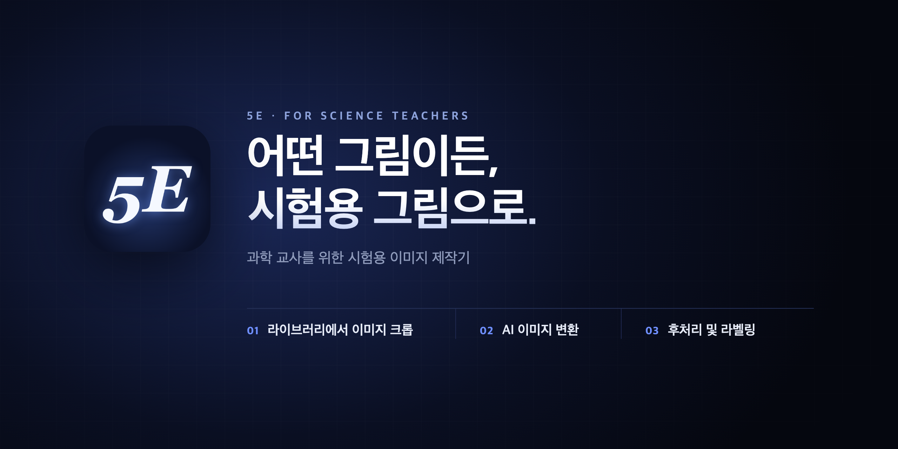
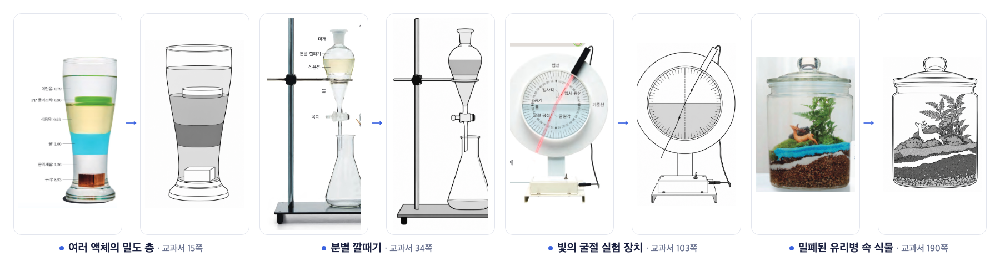
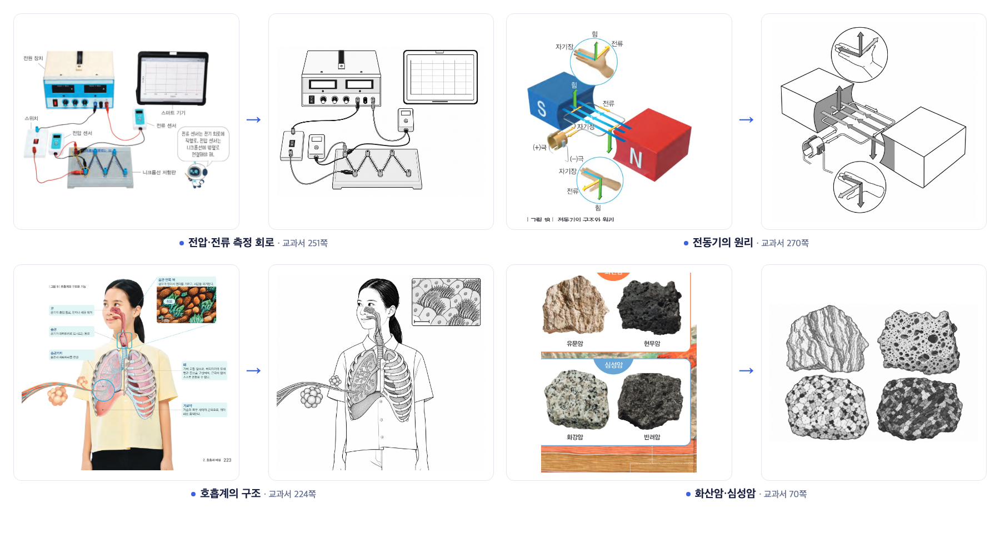

> **릴리즈 설명 검토본입니다.** 현재 공개된 [v1.6.0 릴리즈 페이지](https://github.com/seungyeon980808-pixel/5E/releases/tag/v1.6.0)는 변경하지 않았습니다. 아래는 개선한 설명과 상세 변경 문서로 이동하는 링크를 확인하기 위한 초안입니다.

# 5E v1.6.0 — 어떤 그림이든, 시험용 그림으로

**[웹에서 바로 사용하기](https://www.5e.ai.kr/) · [1.6.0 웹 사용 가이드](https://github.com/seungyeon980808-pixel/5E/blob/codex/docs-160-review-preview/docs/USER_GUIDE_v1.6.0.md)**

| 지금 사용할 수 있는 것 | 출시 범위 |
|---|---|
| 웹 1.6.0 | PDF 검색·크롭 → AI 이미지 변환 → 후처리·라벨링 → 저장·내보내기 |
| 설치판 1.6.0 | Windows·Mac 설치 파일은 준비 중입니다. 로컬 PDF 폴더 연결은 설치판 출시 후 제공합니다. |
| 기존 설치판 | [v1.5.8 Windows](https://github.com/seungyeon980808-pixel/5E/releases/tag/v1.5.8). 1.6.0의 라이브러리·AI 작업대는 포함하지 않습니다. |

**업데이트 전에 작업을 프로젝트 파일로 백업하세요.** 이전 버전의 자동 복구 저장만으로 작업을 옮기지 말고, 저장한 프로젝트 파일을 1.6.0에서 여세요.

## 이번 버전의 주요 변화

- **라이브러리:** 교과서·기출 PDF 본문 검색, 전체 문서 연속 읽기, 여러 영역 크롭과 크롭 보관함을 한 흐름으로 연결했습니다.
- **AI 작업대:** 선화 변환, 원본과 겹쳐 비교, 점·영역 코멘트로 부분 수정, 여러 작업 동시 실행을 제공합니다.
- **후처리와 라벨링:** 배경·색·선 굵기를 조정하고, 물체별 PNG 분리와 지시선 라벨을 붙입니다.
- **작업 보존:** 새 작업 전 복구 보관과 페이지별 실행 취소를 보완했습니다. 자동 저장 실패 시에는 프로젝트 파일로 즉시 저장하세요. 복구는 마지막으로 저장에 성공한 내용까지입니다.
- **웹 AI 연결:** ChatGPT 기기 로그인과 서버가 제공하는 모델 선택을 지원합니다. 사용 가능한 모델과 설정은 계정·연결 환경에 따라 달라집니다.

## 실제 변환 예시

2026-09-30 제작 기록 · GPT-6-Astra · 사고 수준 낮음(low) · 교과서 그림 8장을 각각의 작업으로 동시에 요청 · 작업별 약 67~102초, 전체 약 2분. 손으로 고치지 않은 AI 결과입니다. 다른 모델·원본·서버 대기 상황에서는 시간과 품질이 달라질 수 있습니다.

## 상세 변경 내용

아래 링크는 GitHub에서 제목 이동을 지원하는 **상세 변경 문서**의 해당 항목을 엽니다.

- [라이브러리 검색·읽기·크롭](https://github.com/seungyeon980808-pixel/5E/blob/codex/docs-160-review-preview/docs/RELEASE_NOTES_v1.6.0.md#user-content-1단계--라이브러리에서-이미지-크롭)
- [AI 변환·부분 수정·비교·동시 실행](https://github.com/seungyeon980808-pixel/5E/blob/codex/docs-160-review-preview/docs/RELEASE_NOTES_v1.6.0.md#user-content-2단계--ai-이미지-변환)
- [후처리·물체별 분리·라벨링](https://github.com/seungyeon980808-pixel/5E/blob/codex/docs-160-review-preview/docs/RELEASE_NOTES_v1.6.0.md#user-content-3단계--후처리-및-라벨링)
- [편집 화면과 캔버스](https://github.com/seungyeon980808-pixel/5E/blob/codex/docs-160-review-preview/docs/RELEASE_NOTES_v1.6.0.md#user-content-편집-화면과-캔버스)
- [작업 보존과 복구](https://github.com/seungyeon980808-pixel/5E/blob/codex/docs-160-review-preview/docs/RELEASE_NOTES_v1.6.0.md#user-content-작업-보존과-복구)
- [저장과 내보내기](https://github.com/seungyeon980808-pixel/5E/blob/codex/docs-160-review-preview/docs/RELEASE_NOTES_v1.6.0.md#user-content-저장과-내보내기)
- [알려진 제한과 업데이트 전 백업](https://github.com/seungyeon980808-pixel/5E/blob/codex/docs-160-review-preview/docs/RELEASE_NOTES_v1.6.0.md#user-content-알려진-제한)
- [전체 변경 내용](https://github.com/seungyeon980808-pixel/5E/blob/codex/docs-160-review-preview/docs/RELEASE_NOTES_v1.6.0.md)

## 사용 전에 알아둘 점

- AI 결과는 원본의 물체 수·배치·과학적 관계를 비교한 뒤 시험지에 사용하세요. 예시의 성공 결과가 모든 모델과 이미지에서 같은 품질을 보장하지는 않습니다.
- 물체별 분리는 투명 PNG로 나누는 이미지 분리입니다. 맞닿거나 겹친 물체는 함께 나뉠 수 있으며, 내부 선을 벡터로 바꾸지는 않습니다.
- AI 로그인은 서버 재시작 또는 30분 미사용으로 끝날 수 있습니다. 이때는 다시 로그인합니다.
- 공유 링크는 최대 1시간 유지됩니다. 서버 재시작으로 사라진 링크는 작업에서 새로 만들어 전달해야 하며, 재로그인으로 복원되지는 않습니다.
- 교과서·기출 자료는 각 저작권자의 이용 조건을 따릅니다.

[현재 배포 채널 안내](https://github.com/seungyeon980808-pixel/5E/blob/codex/docs-160-review-preview/docs/RELEASE_CHANNELS.md) · [프로그램 소개와 구조](https://github.com/seungyeon980808-pixel/5E/blob/codex/docs-160-review-preview/README.md)
